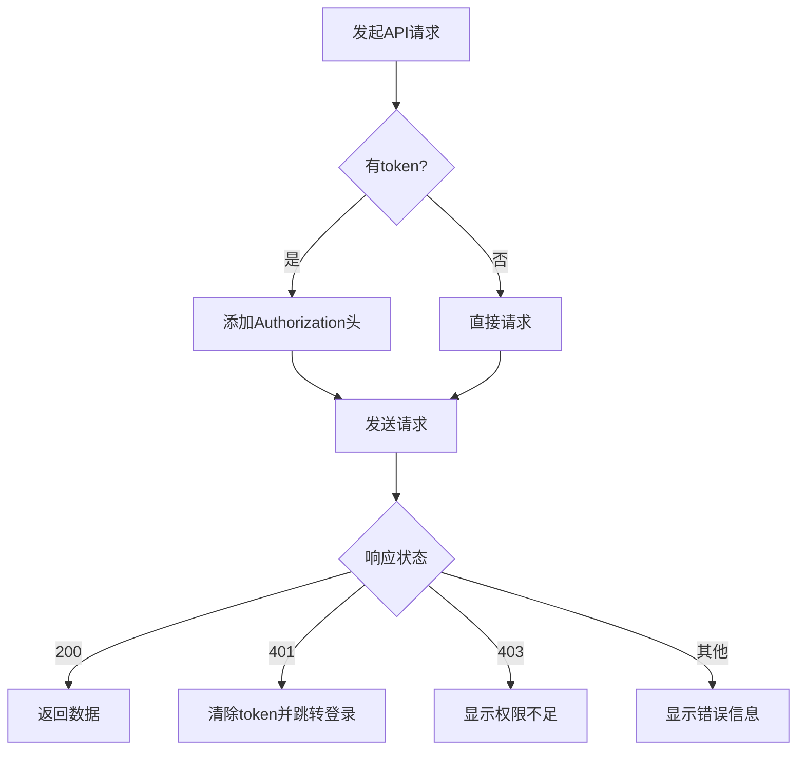
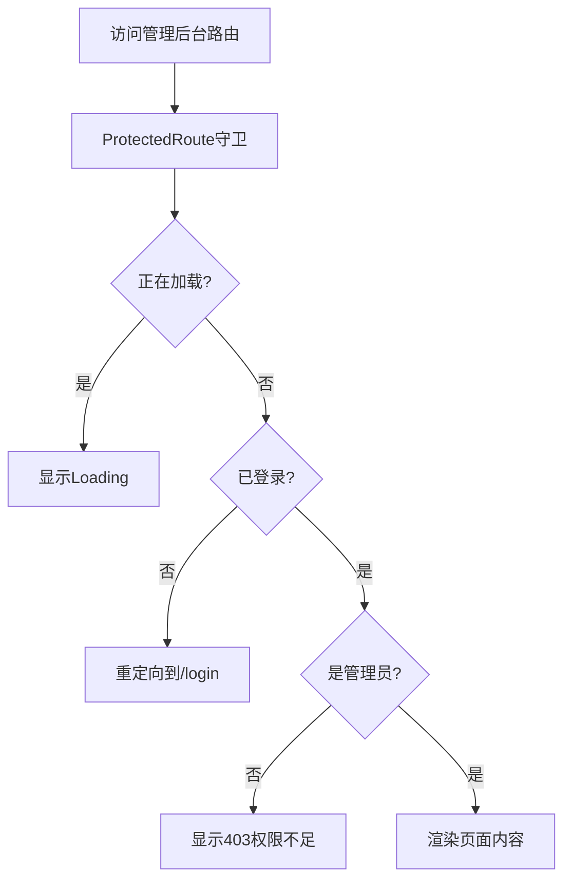

# 管理后台认证与动态数据实施文档

本文档记录了为 AuthHub 管理后台添加完整认证鉴权机制和动态数据加载的实施过程。

## 实施日期

2025-11-16

## 问题描述

### 问题1：缺少认证保护
- 前端路由完全开放，任何人可直接访问 `/dashboard` 等管理页面
- 未实现飞书登录回调的token处理和存储  
- 没有路由守卫检查用户登录状态和管理员权限

### 问题2：仪表盘数据写死
- Dashboard页面显示硬编码数据（系统数:5、用户数:128、角色数:15）
- 后端尚未提供统计数据API接口

## 实施方案

### 一、后端开发

#### 1. 新增统计数据API接口

**文件**: `backend/app/rbac/router.py`

新增 `/api/v1/rbac/stats` 接口：
- 需要管理员权限（`require_admin` 依赖）
- 统计系统总数、用户总数、角色总数
- 使用 SQLAlchemy 的 `func.count()` 进行高效统计

```python
@router.get("/stats", response_model=StatsResponse)
async def get_stats(
    current_user: dict = Depends(require_admin),
    db: AsyncSession = Depends(get_db)
):
    """获取系统统计数据（需要管理员权限）"""
    # 统计逻辑...
```

#### 2. 新增Schema定义

**文件**: `backend/app/schemas/rbac.py`

```python
class StatsResponse(BaseModel):
    """统计数据响应"""
    system_count: int = Field(..., description="系统总数")
    user_count: int = Field(..., description="用户总数")
    role_count: int = Field(..., description="角色总数")
```

### 二、前端开发

#### 1. API工具函数和类型定义

**新增文件**:
- `frontend/src/types/api.ts` - 定义所有API相关的TypeScript类型
- `frontend/src/utils/api.ts` - 封装fetch请求工具

**核心功能**:
- 自动添加 `Authorization: Bearer <token>` 头
- 统一错误处理（401跳转登录，403权限提示）
- Token存储管理（localStorage）
- 请求/响应类型安全

#### 2. 认证上下文管理

**新增文件**: `frontend/src/contexts/AuthContext.tsx`

提供全局认证状态管理：
- `user`: 当前用户信息
- `loading`: 加载状态
- `isAuthenticated`: 是否已登录
- `isAdmin`: 是否是管理员（检查 `global_roles` 是否包含 `"admin"`）
- `login()`: 登录方法
- `logout()`: 登出方法
- `refreshUser()`: 刷新用户信息

#### 3. 路由守卫组件

**新增文件**: `frontend/src/components/ProtectedRoute.tsx`

保护需要管理员权限的路由：
1. 加载中显示 Spin 组件
2. 未登录重定向到 `/login`
3. 已登录但非管理员显示 403 权限不足页面
4. 管理员正常渲染子组件

#### 4. 飞书登录回调页面

**新增文件**: `frontend/src/pages/Login/Callback.tsx`

处理飞书登录回调流程：
1. 解析URL中的 `code` 参数
2. 调用 `/api/v1/auth/feishu/callback` 换取token
3. 保存token到localStorage
4. 调用 `/api/v1/auth/me` 获取用户信息
5. 跳转到仪表盘或显示错误信息

#### 5. 路由配置改造

**修改文件**: `frontend/src/App.tsx`

- 添加 `/login/callback` 公开路由
- 使用 `ProtectedRoute` 包裹所有管理后台路由
- 保证只有管理员可以访问后台页面

**修改文件**: `frontend/src/main.tsx`

- 添加 `AuthProvider` 包裹整个应用
- 提供全局认证上下文

#### 6. 仪表盘动态数据

**修改文件**: `frontend/src/pages/Dashboard/index.tsx`

改造为动态数据加载：
- 使用 `@tanstack/react-query` 的 `useQuery` Hook
- 调用 `/api/v1/rbac/stats` 接口获取真实统计数据
- 添加加载状态和错误处理
- 移除所有硬编码数据

#### 7. 布局组件增强

**修改文件**: `frontend/src/components/Layout/MainLayout.tsx`

新增功能：
- 右上角显示当前用户信息（用户名、邮箱）
- 用户头像和下拉菜单
- 登出按钮（带确认对话框）
- 调用登出API并清除本地token

## 技术要点

### 权限判断机制

管理员权限判断基于JWT Token中的 `global_roles` 字段：

```typescript
const isAdmin = user?.global_roles?.includes('admin') ?? false
```

后端在飞书登录回调时会收集用户的完整权限信息，并将全局角色写入JWT。

### Token管理流程


### 请求认证流程



### 路由保护流程



## 文件清单

### 后端新增/修改

- ✅ `backend/app/rbac/router.py` - 新增stats接口
- ✅ `backend/app/schemas/rbac.py` - 新增StatsResponse Schema

### 前端新增

- ✅ `frontend/src/contexts/AuthContext.tsx` - 认证上下文
- ✅ `frontend/src/components/ProtectedRoute.tsx` - 路由守卫
- ✅ `frontend/src/pages/Login/Callback.tsx` - 登录回调页面
- ✅ `frontend/src/utils/api.ts` - API工具函数
- ✅ `frontend/src/types/api.ts` - API类型定义

### 前端修改

- ✅ `frontend/src/App.tsx` - 路由配置
- ✅ `frontend/src/pages/Dashboard/index.tsx` - 动态数据加载
- ✅ `frontend/src/components/Layout/MainLayout.tsx` - 用户信息和登出
- ✅ `frontend/src/main.tsx` - 添加AuthProvider

## 测试建议

### 功能测试

1. **未登录访问测试**
   - 直接访问 `/dashboard`
   - 应重定向到 `/login`

2. **飞书登录流程测试**
   - 点击飞书登录按钮
   - 完成授权后应自动跳转回仪表盘
   - 检查token是否正确存储

3. **非管理员用户测试**
   - 使用非管理员账号登录
   - 应显示403权限不足页面

4. **管理员用户测试**
   - 使用管理员账号登录
   - 应正常访问所有管理页面
   - 仪表盘显示真实统计数据

5. **登出功能测试**
   - 点击右上角用户菜单
   - 点击退出登录
   - 确认后应跳转到登录页
   - token应被清除

6. **刷新页面测试**
   - 登录后刷新页面
   - 应保持登录状态
   - 数据应正常加载

### API测试

使用以下命令测试统计API：

```bash
# 需要先获取管理员token
curl -H "Authorization: Bearer <admin_token>" \
  http://localhost:8000/api/v1/rbac/stats
```

预期响应：
```json
{
  "system_count": 0,
  "user_count": 1,
  "role_count": 0
}
```

## 注意事项

1. **Token过期处理**: 当JWT过期时，API会返回401，前端会自动清除token并跳转到登录页

2. **管理员权限**: 只有 `global_roles` 包含 `"admin"` 的用户才能访问管理后台

3. **本地存储**: Token存储在localStorage中，刷新页面不会丢失登录状态

4. **安全性**: 
   - 所有管理API都需要管理员权限
   - Token使用RS256算法签名
   - 支持Token黑名单机制

5. **错误处理**: 所有API调用都有统一的错误处理和用户友好的提示信息

## 后续优化建议

1. **Token自动刷新**: 在token即将过期时自动刷新
2. **权限细化**: 支持更细粒度的功能权限控制
3. **会话管理**: 支持查看和管理活跃会话
4. **日志审计**: 记录管理员的所有操作
5. **多因素认证**: 为管理员账号添加额外的安全保护


