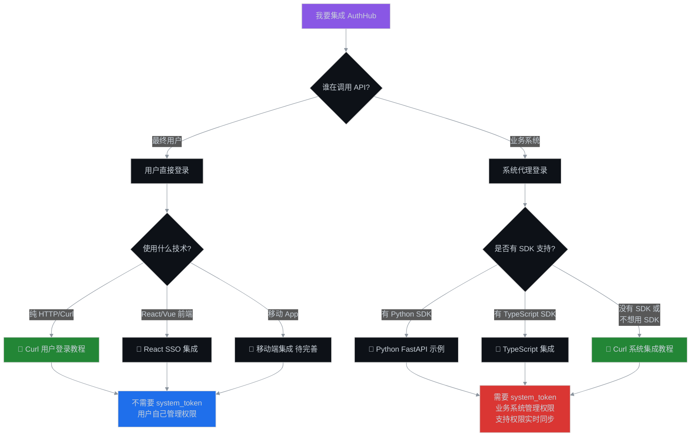
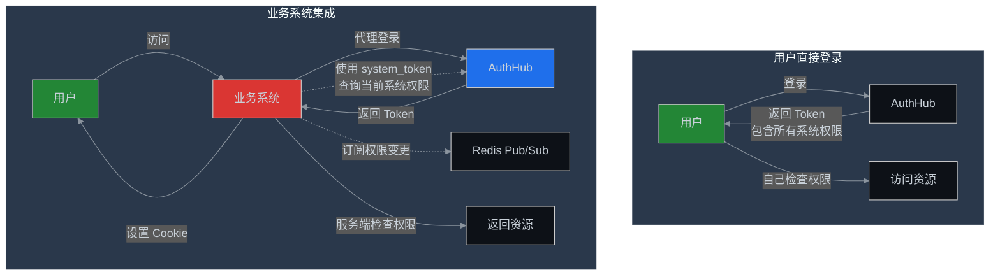

# AuthHub 认证集成指南

## 📚 文档导航

根据你的使用场景，选择合适的集成方式：

### 🎯 场景选择流程



---

## 📖 文档列表

### 1️⃣ 用户直接登录场景

**适用于**: API 测试、移动 App、前端 SPA

| 文档 | 说明 | 是否需要 system_token |
|------|------|:-------------------:|
| [Curl 用户登录教程](./curl-authentication-guide.md) | 纯 curl 命令演示用户登录流程 | ❌ 不需要 |

**特点**：
- ✅ 用户直接与 AuthHub 交互
- ✅ 返回的 Token 包含所有系统权限
- ✅ 客户端自行管理 Token
- ❌ 不支持权限实时同步

**典型流程**：
```bash
# 1. 获取登录 URL
curl -X POST "http://localhost:8000/auth/sso/login-url" \
  -H "Content-Type: application/json" \
  -d '{"redirect_uri": "http://localhost:3000/callback"}'

# 2. 用户在浏览器登录飞书

# 3. 用 code 交换 Token
curl -X POST "http://localhost:8000/auth/sso/exchange-token" \
  -H "Content-Type: application/json" \
  -d '{"code": "xxx", "state": "xxx"}'

# 4. 使用 Token 访问资源
curl -X GET "http://localhost:8000/auth/me" \
  -H "Authorization: Bearer ${ACCESS_TOKEN}"
```

---

### 2️⃣ 业务系统集成场景

**适用于**: 企业内部系统、微服务架构、多租户系统

| 文档 | 说明 | 是否需要 system_token |
|------|------|:-------------------:|
| [⭐ Curl 系统集成教程](./curl-system-integration-guide.md) | **不依赖 SDK** 的纯 HTTP 系统集成方案 | ✅ 需要 |
| [Python FastAPI 示例](../../sdk/python/examples/fastapi_sso_example.py) | 使用 Python SDK 的完整示例 | ✅ 需要 |
| [TypeScript SDK 文档](../../sdk/typescript/README.md) | 使用 TypeScript SDK | ✅ 需要 |

**特点**：
- ✅ 业务系统代理用户登录
- ✅ 服务端权限检查（更安全）
- ✅ 支持权限实时同步（Redis Pub/Sub）
- ✅ 支持系统级权限隔离

**典型流程**：
```bash
# 前置步骤: 获取系统凭证
# system_id=1, system_token=eyJ...

# 1. 用户访问业务系统，自动重定向到登录页

# 2. 业务系统调用 AuthHub 获取登录 URL
curl -X POST "http://localhost:8000/auth/sso/login-url" \
  -H "Content-Type: application/json" \
  -d '{"redirect_uri": "http://biz-system.com/auth/callback"}'

# 3. 用户在飞书登录后，业务系统处理回调

# 4. 业务系统用 code 交换 Token
curl -X POST "http://localhost:8000/auth/sso/exchange-token" \
  -H "Content-Type: application/json" \
  -d '{"code": "xxx", "state": "xxx"}'

# 5. 业务系统设置 Cookie，用户继续访问

# 6. 业务系统使用 system_token 查询权限
curl -X GET "http://localhost:8000/api/rbac/users/1/permissions?system_id=1" \
  -H "Authorization: Bearer ${SYSTEM_TOKEN}"
```

---

## 🔑 核心区别对比

### Token 类型

| 场景 | 使用的 Token | 用途 | 有效期 |
|------|-------------|------|--------|
| 用户登录 | User Access Token | 访问 AuthHub API | 1 小时 |
| 用户登录 | User Refresh Token | 刷新 Access Token | 7 天 |
| 系统集成 | User Access Token | 访问 AuthHub API | 1 小时 |
| 系统集成 | User Refresh Token | 刷新 Access Token | 7 天 |
| 系统集成 | **System Token** | **调用管理接口、查询权限** | **1 年** |

### 权限管理方式



### 功能对比表

| 功能 | 用户直接登录 | 系统集成 |
|------|:----------:|:-------:|
| 是否需要 system_token | ❌ | ✅ |
| 权限检查位置 | 客户端 | 服务端（更安全） |
| Token 包含的权限范围 | 所有系统 | 所有系统 |
| 是否可以查询其他用户权限 | ❌ | ✅（使用 system_token） |
| 权限实时同步（Pub/Sub） | ❌ | ✅ |
| 系统级权限隔离 | 手动实现 | ✅ 自动 |
| 审计日志 | 用户级 | 系统级 |
| 适用场景 | 测试、App、前端 | 企业系统、微服务 |

---

## 🚀 快速开始

### 场景1: 我只是想测试 API

**推荐**: [Curl 用户登录教程](./curl-authentication-guide.md)

```bash
# 3 步完成登录
curl -X POST "http://localhost:8000/auth/sso/login-url" \
  -d '{"redirect_uri": "http://localhost:3000/callback"}' | jq .

# 浏览器登录后，用 code 交换 Token
curl -X POST "http://localhost:8000/auth/sso/exchange-token" \
  -d '{"code": "xxx", "state": "xxx"}' | jq .

# 使用 Token 访问
curl -X GET "http://localhost:8000/auth/me" \
  -H "Authorization: Bearer ${TOKEN}" | jq .
```

### 场景2: 我要集成业务系统（有 SDK）

**推荐**: 使用对应语言的 SDK

**Python**:
```python
from authhub_sdk import AuthHubClient
from authhub_sdk.middleware.fastapi_sso import setup_sso

authhub_client = AuthHubClient(
    authhub_url="http://localhost:8000",
    system_id="1",
    system_token="eyJ...",
    namespace="data-center",
)

setup_sso(app, client=authhub_client)
```

**TypeScript**:
```typescript
import { AuthHubClient } from 'authhub-sdk';

const client = new AuthHubClient({
  authhubUrl: 'http://localhost:8000',
  systemId: '1',
  systemToken: 'eyJ...',
  namespace: 'data-center',
});
```

### 场景3: 我要集成业务系统（没有 SDK）

**推荐**: [Curl 系统集成教程](./curl-system-integration-guide.md)

使用纯 HTTP 请求实现完整的 SSO 流程，适配任何语言和框架。

```bash
# 查看完整教程
cat docs/authentication/curl-system-integration-guide.md
```

---

## 🔐 安全建议

### 1. 生产环境必须使用 HTTPS

```bash
# ❌ 错误 - HTTP 不安全
export AUTHHUB_URL="http://authhub.example.com"

# ✅ 正确 - HTTPS 安全
export AUTHHUB_URL="https://authhub.example.com"
```

### 2. 妥善保管 system_token

```bash
# ✅ 推荐：环境变量
export SYSTEM_TOKEN="eyJ..."

# ✅ 推荐：配置文件（不提交到 Git）
echo "SYSTEM_TOKEN=eyJ..." >> .env
echo ".env" >> .gitignore

# ❌ 禁止：硬编码到代码中
const SYSTEM_TOKEN = "eyJ..."  # 不要这样做！
```

### 3. Cookie 安全配置

```http
Set-Cookie: authhub_token={token};
    HttpOnly;      # 防止 XSS
    Secure;        # 仅 HTTPS
    SameSite=Lax;  # 防止 CSRF
```

### 4. Token 刷新策略

```javascript
// 提前 5 分钟刷新，避免用户感知
if (token_expires_in < 300) {
    await refreshToken();
}
```

---

## 📊 集成检查清单

### 用户登录集成

- [ ] 实现获取登录 URL
- [ ] 实现 SSO 回调处理
- [ ] 实现 Token 存储（Cookie/LocalStorage）
- [ ] 实现 Token 验证
- [ ] 实现 Token 刷新
- [ ] 实现登出逻辑
- [ ] 添加错误处理

### 系统集成（额外步骤）

- [ ] 获取 system_id 和 system_token
- [ ] 实现系统级权限检查
- [ ] 实现权限缓存
- [ ] 订阅权限变更（可选）
- [ ] 实现审计日志（可选）

---

## 🆘 常见问题

### Q1: 什么时候需要 system_token？

**A**: 当你的代码是**业务系统**而不是**最终用户**时。

- ❌ 不需要：移动 App、前端 SPA、API 测试
- ✅ 需要：企业内部系统、微服务、多租户平台

### Q2: 没有对应语言的 SDK 怎么办？

**A**: 参考 [Curl 系统集成教程](./curl-system-integration-guide.md)，使用纯 HTTP 请求集成。

### Q3: Token 过期了怎么办？

**A**: 使用 refresh_token 刷新。建议在 Token 还有 5 分钟过期时就开始刷新。

### Q4: 如何在本地验证 JWT？

**A**: 下载 AuthHub 公钥，使用 JWT 库验证签名：

```bash
curl -X GET "http://localhost:8000/auth/public-key" \
  | jq -r .public_key > public_key.pem
```

### Q5: 权限变更后如何实时更新？

**A**: 
- **用户登录场景**: 需要重新登录
- **系统集成场景**: 订阅 Redis Pub/Sub 获取实时通知

---

## 📞 获取帮助

- **技术文档**: [docs/](../)
- **示例代码**: [sdk/](../../sdk/)
- **问题反馈**: GitHub Issues

---

## 📅 更新日志

| 日期 | 版本 | 说明 |
|------|------|------|
| 2024-11-21 | v1.0 | 初始版本，完善认证文档导航 |

