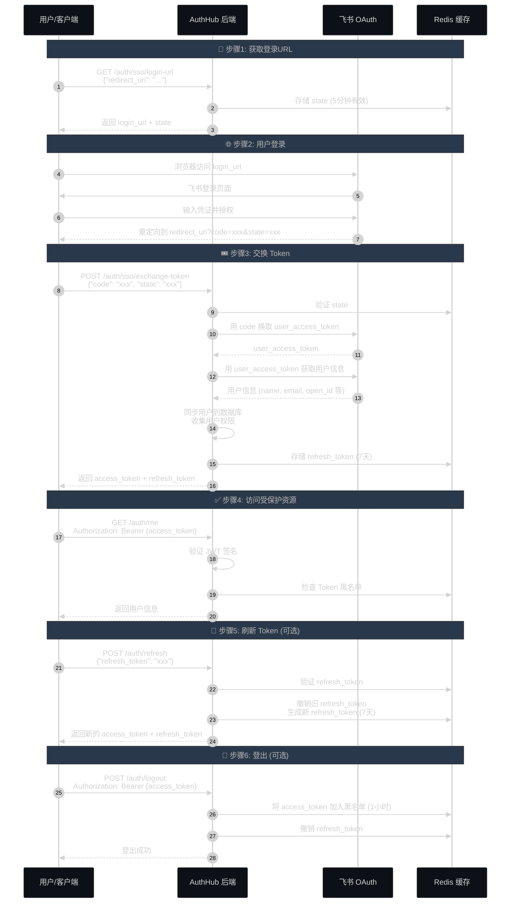
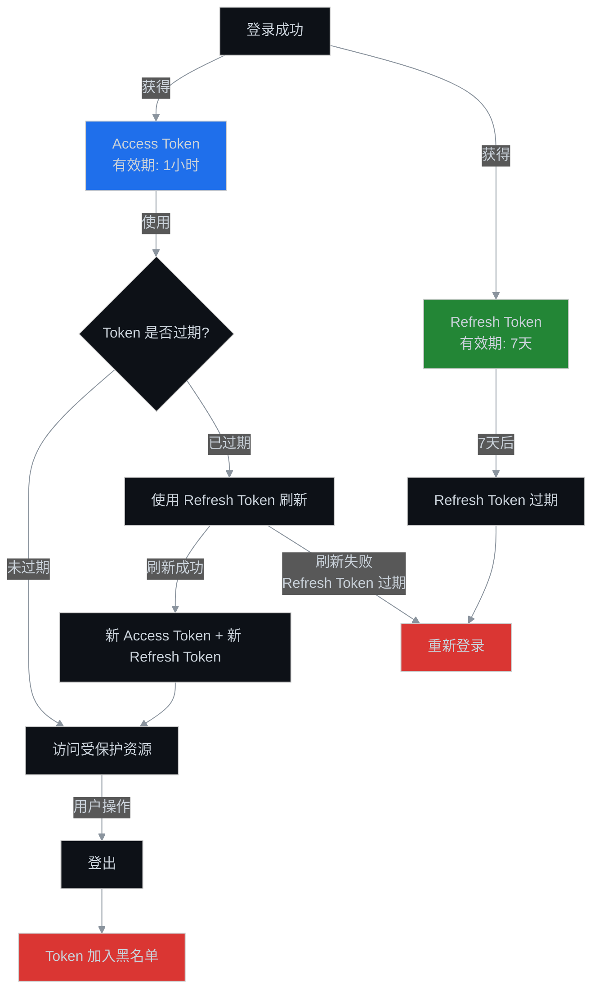

# AuthHub 纯 Curl 登录和鉴权教程

## 概述

本文档提供一个**不依赖任何框架**的纯 curl 方式，演示如何与 AuthHub 后端进行登录和鉴权。适用于测试、调试或在没有 SDK 的环境下快速集成。

## ⚠️ 重要说明：两种使用场景

### 场景1：用户直接登录（本文档）

**适用场景**：
- API 测试和调试
- 移动 App 直接集成
- 前端 SPA 直接调用后端

**特点**：
- ✅ **不需要** `system_id` 和 `system_token`
- ✅ 用户直接与 AuthHub 交互
- ✅ 返回的 Token 包含用户在所有系统的权限
- ✅ 客户端自行管理 Token 和权限检查

```bash
# 示例：直接调用 AuthHub API，无需系统凭证
curl -X POST "http://localhost:8000/auth/sso/login-url" \
  -H "Content-Type: application/json" \
  -d '{"redirect_uri": "http://localhost:3000/callback"}'
```

### 场景2：业务系统集成 SSO（参考 SDK 文档）

**适用场景**：
- 企业内部系统接入统一认证
- 微服务架构中的服务认证
- 多租户系统的权限隔离

**特点**：
- ❌ **需要** `system_id` 和 `system_token`（业务系统的身份凭证）
- ✅ 业务系统代理用户登录
- ✅ 支持权限查询和实时同步（Redis Pub/Sub）
- ✅ 服务端权限检查（更安全）

```python
# 示例：业务系统集成需要系统凭证
authhub_client = AuthHubClient(
    authhub_url="http://localhost:8000",
    system_id="1",  # 必需：系统ID
    system_token="eyJ...",  # 必需：系统Token
    namespace="data-center",
    redis_url="redis://localhost:6379/0",
)
```

📖 **如需集成业务系统 SSO，请参考**：
- **[⭐ 业务系统纯 HTTP/Curl SSO 集成指南](./curl-system-integration-guide.md)** - 不依赖 SDK 的系统集成方案
- [SDK 完整集成指南](../sdk/complete-integration-guide.md)
- [Python FastAPI SSO 示例](../../sdk/python/examples/fastapi_sso_example.py)

---

## 前置条件

- AuthHub 后端服务已启动（默认运行在 `http://localhost:8000`）
- 已安装 `curl` 和 `jq`（用于格式化 JSON）
- 有飞书账号用于登录（或已有其他用户账号）

## 认证流程图



## API 端点列表

| 端点 | 方法 | 说明 |
|------|------|------|
| `/auth/sso/login-url` | POST | 获取 SSO 登录 URL |
| `/auth/sso/exchange-token` | POST | 用授权码交换 JWT Token |
| `/auth/refresh` | POST | 刷新访问令牌 |
| `/auth/me` | GET | 获取当前用户信息 |
| `/auth/logout` | POST | 登出（撤销 Token） |
| `/auth/public-key` | GET | 获取 JWT 验证公钥 |

---

## 完整操作步骤

### 1️⃣ 获取 SSO 登录 URL

**原理**: 生成一个飞书 OAuth 授权 URL，并创建一个防 CSRF 的 `state` 参数。

```bash
# 设置后端地址
export API_BASE="http://localhost:8000"

# 1. 获取登录 URL
curl -X POST "${API_BASE}/auth/sso/login-url" \
  -H "Content-Type: application/json" \
  -d '{
    "redirect_uri": "http://localhost:3000/callback"
  }' | jq .
```

**响应示例**:
```json
{
  "login_url": "https://open.feishu.cn/open-apis/authen/v1/index?app_id=cli_xxx&redirect_uri=http://localhost:3000/callback&state=abc123",
  "state": "abc123"
}
```

**保存变量**:
```bash
# 保存 state (后续交换 token 时需要)
export SSO_STATE="abc123"  # 替换为实际返回的 state

# 保存 login_url
export LOGIN_URL="https://open.feishu.cn/open-apis/authen/v1/index?app_id=cli_xxx&redirect_uri=http://localhost:3000/callback&state=abc123"
```

---

### 2️⃣ 浏览器登录并获取授权码

**原理**: 用户在浏览器中访问 `login_url`，完成飞书登录后会重定向回 `redirect_uri?code=xxx&state=xxx`。

```bash
# 在浏览器中打开登录 URL
open "${LOGIN_URL}"  # macOS
# 或 xdg-open "${LOGIN_URL}"  # Linux
# 或直接复制到浏览器
```

**操作步骤**:
1. 浏览器会跳转到飞书登录页面
2. 输入飞书账号密码并授权
3. 飞书会重定向到 `http://localhost:3000/callback?code=xxx&state=abc123`
4. 从 URL 中复制 `code` 参数的值

**示例重定向 URL**:
```
http://localhost:3000/callback?code=e8f7d6c5b4a3&state=abc123
```

**保存授权码**:
```bash
export AUTH_CODE="e8f7d6c5b4a3"  # 替换为实际的 code
```

---

### 3️⃣ 用授权码交换 JWT Token

**原理**: 
1. 验证 `state` 参数（防 CSRF）
2. 用 `code` 向飞书换取 `user_access_token`
3. 用 `user_access_token` 获取用户信息
4. 同步用户到数据库并收集权限
5. 生成 JWT `access_token` 和 `refresh_token`

```bash
# 2. 用授权码交换 Token
curl -X POST "${API_BASE}/auth/sso/exchange-token" \
  -H "Content-Type: application/json" \
  -d "{
    \"code\": \"${AUTH_CODE}\",
    \"state\": \"${SSO_STATE}\"
  }" | jq .
```

**响应示例**:
```json
{
  "access_token": "eyJhbGciOiJSUzI1NiIsInR5cCI6IkpXVCJ9.eyJzdWIiOiIxIiwidXNlcl90eXBlIjoidXNlciIsInVzZXJuYW1lIjoi5byg5LiJ...",
  "refresh_token": "aXJkN2w4ZmtkajM4ZmprZGpmODM0aGZramRzODM0aGZramRmODM0aGY...",
  "token_type": "bearer",
  "expires_in": 3600,
  "refresh_expires_in": 604800
}
```

**保存 Token**:
```bash
# 保存 access_token (1小时有效)
export ACCESS_TOKEN="eyJhbGciOiJSUzI1NiIsInR5cCI6IkpXVCJ9.eyJzdWIiOiIxIiwidXNlcl90eXBlIjoidXNlciIsInVzZXJuYW1lIjoi5byg5LiJ..."

# 保存 refresh_token (7天有效)
export REFRESH_TOKEN="aXJkN2w4ZmtkajM4ZmprZGpmODM0aGZramRzODM0aGZramRmODM0aGY..."
```

---

### 4️⃣ 访问受保护的资源

**原理**: 
1. 在 `Authorization` 请求头中携带 `Bearer {access_token}`
2. 后端验证 JWT 签名
3. 检查 Token 是否在黑名单
4. 从 Token 中提取用户信息和权限

```bash
# 3. 获取当前用户信息
curl -X GET "${API_BASE}/auth/me" \
  -H "Authorization: Bearer ${ACCESS_TOKEN}" | jq .
```

**响应示例**:
```json
{
  "sub": "1",
  "user_type": "user",
  "username": "张三",
  "email": "zhangsan@example.com",
  "dept_ids": ["od-123", "od-456"],
  "dept_names": ["技术部", "研发中心"],
  "global_roles": ["developer"],
  "system_roles": {
    "system-a": ["admin"],
    "system-b": ["user"]
  },
  "global_resources": {
    "project": ["1", "2", "3"]
  },
  "system_resources": {
    "system-a": {
      "database": ["db-001", "db-002"]
    }
  },
  "exp": 1732276800,
  "iat": 1732273200,
  "jti": "user_1_1732273200"
}
```

---

### 5️⃣ 刷新访问令牌

**原理**: 
1. 当 `access_token` 过期时（1小时后），使用 `refresh_token` 获取新的令牌
2. 后端撤销旧 `refresh_token` 并生成新的（token rotation 机制）
3. 返回新的 `access_token` 和 `refresh_token`

```bash
# 4. 刷新 Token (当 access_token 过期时)
curl -X POST "${API_BASE}/auth/refresh" \
  -H "Content-Type: application/json" \
  -d "{
    \"refresh_token\": \"${REFRESH_TOKEN}\"
  }" | jq .
```

**响应示例**:
```json
{
  "access_token": "eyJhbGciOiJSUzI1NiIsInR5cCI6IkpXVCJ9.NEW_TOKEN...",
  "refresh_token": "NEW_REFRESH_TOKEN...",
  "token_type": "bearer",
  "expires_in": 3600,
  "refresh_expires_in": 604800
}
```

**更新 Token**:
```bash
# 更新 access_token
export ACCESS_TOKEN="eyJhbGciOiJSUzI1NiIsInR5cCI6IkpXVCJ9.NEW_TOKEN..."

# 更新 refresh_token
export REFRESH_TOKEN="NEW_REFRESH_TOKEN..."
```

---

### 6️⃣ 登出

**原理**: 
1. 将 `access_token` 的 `jti` 加入 Redis 黑名单（1小时有效期）
2. 从 Redis 中删除 `refresh_token`
3. 后续使用该 Token 的请求会被拒绝

```bash
# 5. 登出 (可选)
curl -X POST "${API_BASE}/auth/logout" \
  -H "Authorization: Bearer ${ACCESS_TOKEN}" \
  -H "Content-Type: application/json" \
  -d "{
    \"refresh_token\": \"${REFRESH_TOKEN}\"
  }" | jq .
```

**响应示例**:
```json
{
  "message": "登出成功"
}
```

---

## 高级功能

### 🔑 获取 JWT 公钥（用于本地验证）

业务系统可以获取 AuthHub 的 RSA 公钥，在本地验证 JWT Token，无需每次都请求 AuthHub。

```bash
# 获取 JWT 验证公钥
curl -X GET "${API_BASE}/auth/public-key" | jq .
```

**响应示例**:
```json
{
  "public_key": "-----BEGIN PUBLIC KEY-----\nMIIBIjANBgkqhkiG9w0BAQEFAAOCAQ8AMIIBCgKCAQEA...\n-----END PUBLIC KEY-----\n",
  "algorithm": "RS256"
}
```

**使用公钥验证 Token**（示例代码，不使用 curl）:
```bash
# 保存公钥到文件
curl -X GET "${API_BASE}/auth/public-key" | jq -r .public_key > public_key.pem

# 使用 Python 验证 (需要安装 PyJWT)
python3 << EOF
import jwt

# 读取公钥
with open('public_key.pem', 'r') as f:
    public_key = f.read()

# 验证 Token
token = "${ACCESS_TOKEN}"
try:
    payload = jwt.decode(token, public_key, algorithms=['RS256'])
    print("✅ Token 验证成功")
    print(f"用户ID: {payload['sub']}")
    print(f"用户名: {payload['username']}")
    print(f"全局角色: {payload['global_roles']}")
except jwt.ExpiredSignatureError:
    print("❌ Token 已过期")
except jwt.InvalidTokenError:
    print("❌ Token 无效")
EOF
```

---

## 🌐 Web 测试页面

我们提供了一个完整的 HTML 测试页面，可以在浏览器中直接测试 SSO 登录流程：

### 使用方法

1. **打开测试页面**：

```bash
# 在浏览器中打开
open docs/authentication/test-sso.html

# 或使用 Python 启动本地服务器
cd docs/authentication
python3 -m http.server 8080
# 访问: http://localhost:8080/test-sso.html
```

2. **配置 AuthHub 地址**（默认 `http://localhost:8000`）

3. **点击 "获取登录 URL"** → **"打开飞书登录页"**

4. **完成飞书授权**后自动返回并交换 Token

5. **查看用户信息**和完整的调试日志

### 功能特点

- ✅ 完整的 SSO 登录流程演示
- ✅ 实时调试信息显示
- ✅ 支持 Token 刷新测试
- ✅ 支持 Token 解析和公钥获取
- ✅ 美观的 UI 界面（响应式设计）
- ✅ 详细的步骤说明

### 截图

测试页面包含：
- 配置区域（AuthHub URL、回调地址）
- 登录状态显示（用户信息、角色、权限）
- 4 步 SSO 流程（获取 URL → 登录 → 回调 → 获取用户信息）
- API 测试区域（公钥、Token 解析、登出等）
- 实时调试日志

---

## 完整脚本示例

将以下脚本保存为 `auth-test.sh`，可以一键完成登录流程：

```bash
#!/bin/bash
set -e

# 配置
API_BASE="http://localhost:8000"
REDIRECT_URI="http://localhost:3000/callback"

echo "🚀 AuthHub 认证测试脚本"
echo "========================"
echo ""

# 步骤1: 获取登录 URL
echo "📝 步骤1: 获取登录 URL..."
RESPONSE=$(curl -s -X POST "${API_BASE}/auth/sso/login-url" \
  -H "Content-Type: application/json" \
  -d "{\"redirect_uri\": \"${REDIRECT_URI}\"}")

LOGIN_URL=$(echo "$RESPONSE" | jq -r .login_url)
SSO_STATE=$(echo "$RESPONSE" | jq -r .state)

echo "✅ 登录 URL: ${LOGIN_URL}"
echo "✅ State: ${SSO_STATE}"
echo ""

# 步骤2: 提示用户登录
echo "📱 步骤2: 请在浏览器中完成登录"
echo "复制以下 URL 到浏览器:"
echo "${LOGIN_URL}"
echo ""

# 在 macOS 上自动打开浏览器
if [[ "$OSTYPE" == "darwin"* ]]; then
    open "${LOGIN_URL}"
fi

# 步骤3: 等待用户输入授权码
echo "🔐 步骤3: 登录成功后,请从重定向的 URL 中复制 code 参数"
read -p "请输入 code: " AUTH_CODE
echo ""

# 步骤4: 交换 Token
echo "🎟️ 步骤4: 用授权码交换 Token..."
TOKEN_RESPONSE=$(curl -s -X POST "${API_BASE}/auth/sso/exchange-token" \
  -H "Content-Type: application/json" \
  -d "{\"code\": \"${AUTH_CODE}\", \"state\": \"${SSO_STATE}\"}")

ACCESS_TOKEN=$(echo "$TOKEN_RESPONSE" | jq -r .access_token)
REFRESH_TOKEN=$(echo "$TOKEN_RESPONSE" | jq -r .refresh_token)

if [ "$ACCESS_TOKEN" == "null" ]; then
    echo "❌ Token 交换失败"
    echo "$TOKEN_RESPONSE" | jq .
    exit 1
fi

echo "✅ Access Token (前50字符): ${ACCESS_TOKEN:0:50}..."
echo "✅ Refresh Token (前30字符): ${REFRESH_TOKEN:0:30}..."
echo ""

# 步骤5: 获取用户信息
echo "👤 步骤5: 获取当前用户信息..."
USER_INFO=$(curl -s -X GET "${API_BASE}/auth/me" \
  -H "Authorization: Bearer ${ACCESS_TOKEN}")

echo "✅ 用户信息:"
echo "$USER_INFO" | jq .
echo ""

# 步骤6: 测试刷新 Token
echo "🔄 步骤6: 测试刷新 Token..."
REFRESH_RESPONSE=$(curl -s -X POST "${API_BASE}/auth/refresh" \
  -H "Content-Type: application/json" \
  -d "{\"refresh_token\": \"${REFRESH_TOKEN}\"}")

NEW_ACCESS_TOKEN=$(echo "$REFRESH_RESPONSE" | jq -r .access_token)
NEW_REFRESH_TOKEN=$(echo "$REFRESH_RESPONSE" | jq -r .refresh_token)

echo "✅ 新 Access Token (前50字符): ${NEW_ACCESS_TOKEN:0:50}..."
echo "✅ 新 Refresh Token (前30字符): ${NEW_REFRESH_TOKEN:0:30}..."
echo ""

# 步骤7: 登出
echo "🚪 步骤7: 登出..."
LOGOUT_RESPONSE=$(curl -s -X POST "${API_BASE}/auth/logout" \
  -H "Authorization: Bearer ${NEW_ACCESS_TOKEN}" \
  -H "Content-Type: application/json" \
  -d "{\"refresh_token\": \"${NEW_REFRESH_TOKEN}\"}")

echo "✅ 登出结果:"
echo "$LOGOUT_RESPONSE" | jq .
echo ""

# 步骤8: 验证登出 (应该失败)
echo "🔍 步骤8: 验证登出 (尝试使用已登出的 Token)..."
VERIFY_RESPONSE=$(curl -s -X GET "${API_BASE}/auth/me" \
  -H "Authorization: Bearer ${NEW_ACCESS_TOKEN}")

echo "预期失败:"
echo "$VERIFY_RESPONSE" | jq .
echo ""

echo "🎉 测试完成!"
```

**使用方法**:
```bash
chmod +x auth-test.sh
./auth-test.sh
```

---

## JWT Token 结构详解

### Token Payload 字段说明

| 字段 | 类型 | 说明 |
|------|------|------|
| `sub` | string | 用户ID |
| `user_type` | string | 用户类型: "user" (普通用户) / "system" (系统) |
| `username` | string | 用户名 |
| `email` | string | 邮箱 |
| `dept_ids` | array | 部门ID列表 |
| `dept_names` | array | 部门名称列表 |
| `global_roles` | array | 全局角色列表 (如: "admin", "developer") |
| `system_roles` | object | 系统角色字典 {system_code: [roles]} |
| `global_resources` | object | 全局资源 {resource_type: [ids]} |
| `system_resources` | object | 系统资源 {system_code: {resource_type: [ids]}} |
| `exp` | int | 过期时间 (Unix 时间戳) |
| `iat` | int | 签发时间 (Unix 时间戳) |
| `jti` | string | JWT ID (唯一标识符，用于黑名单) |

### 解析 JWT Token

```bash
# 方法1: 使用 jq 解析 (需要先分割 Token)
echo "${ACCESS_TOKEN}" | cut -d'.' -f2 | base64 -d 2>/dev/null | jq .

# 方法2: 使用在线工具
# 访问 https://jwt.io/ 并粘贴 Token
```

---

## 错误处理

### 常见错误码

| HTTP 状态码 | 错误信息 | 原因 | 解决方案 |
|-------------|---------|------|---------|
| 400 | "登录失败: xxx" | 授权码无效或已过期 | 重新获取登录 URL 并完成授权 |
| 400 | "无效的 state 参数或已过期" | state 验证失败 | 确保使用正确的 state，且在5分钟内完成 |
| 401 | "无效的认证头" | Authorization 头格式错误 | 确保格式为 "Bearer {token}" |
| 401 | "Token已过期" | access_token 已过期 | 使用 refresh_token 刷新 |
| 401 | "Token已被撤销" | Token 在黑名单中 | 重新登录 |
| 401 | "Invalid or expired refresh token" | refresh_token 无效 | 重新登录 |
| 403 | "需要管理员权限" | 缺少相应权限 | 联系管理员分配权限 |

### 错误处理示例

```bash
# 带错误处理的请求示例
RESPONSE=$(curl -s -w "\n%{http_code}" -X GET "${API_BASE}/auth/me" \
  -H "Authorization: Bearer ${ACCESS_TOKEN}")

HTTP_CODE=$(echo "$RESPONSE" | tail -n 1)
BODY=$(echo "$RESPONSE" | head -n -1)

if [ "$HTTP_CODE" -eq 200 ]; then
    echo "✅ 请求成功"
    echo "$BODY" | jq .
elif [ "$HTTP_CODE" -eq 401 ]; then
    echo "❌ 认证失败 (401)"
    ERROR_MSG=$(echo "$BODY" | jq -r .detail)
    
    if [[ "$ERROR_MSG" == *"已过期"* ]]; then
        echo "🔄 Token 已过期，尝试刷新..."
        # 执行刷新逻辑
    else
        echo "🔐 需要重新登录"
    fi
else
    echo "❌ 请求失败 (HTTP $HTTP_CODE)"
    echo "$BODY" | jq .
fi
```

---

## 安全最佳实践

### 1. Token 存储

✅ **推荐做法**:
- 在内存中存储 `access_token`（不持久化）
- 在 `HttpOnly Cookie` 中存储 `refresh_token`（Web 应用）
- 在安全存储中保存 `refresh_token`（移动应用: Keychain/Keystore）

❌ **不推荐做法**:
- 不要在 localStorage 存储 Token（易受 XSS 攻击）
- 不要在 URL 中传递 Token
- 不要在日志中记录完整 Token

### 2. Token 生命周期



### 3. HTTPS 要求

⚠️ **生产环境必须使用 HTTPS**:
- 防止 Token 在传输过程中被截获
- 防止中间人攻击 (MITM)

```bash
# 生产环境示例
export API_BASE="https://authhub.example.com"  # 注意是 https
```

### 4. CORS 配置

如果从浏览器调用 API，需要配置 CORS：

```bash
# 后端配置 (backend/app/core/config.py)
CORS_ORIGINS: List[str] = [
    "http://localhost:3000",
    "https://yourdomain.com"
]
```

---

## 测试用例

### 预期输入和输出

以下是 10 个测试场景：

#### Case 1: 正常登录流程
```bash
输入: 正确的授权码和 state
预期: 返回 access_token 和 refresh_token，状态码 200
```

#### Case 2: 无效的授权码
```bash
输入: 错误的授权码
预期: 返回 {"detail": "登录失败: xxx"}，状态码 400
```

#### Case 3: State 验证失败
```bash
输入: 错误的 state 或已过期的 state
预期: 返回 {"detail": "无效的 state 参数或已过期"}，状态码 400
```

#### Case 4: 使用有效 Token 访问资源
```bash
输入: 有效的 access_token
预期: 返回用户信息，状态码 200
```

#### Case 5: 使用过期 Token 访问资源
```bash
输入: 过期的 access_token (等待1小时)
预期: 返回 {"detail": "Token已过期"}，状态码 401
```

#### Case 6: 使用无效 Token 访问资源
```bash
输入: 格式错误的 Token 或签名不匹配的 Token
预期: 返回 {"detail": "Token无效"}，状态码 401
```

#### Case 7: 刷新 Token 成功
```bash
输入: 有效的 refresh_token
预期: 返回新的 access_token 和 refresh_token，状态码 200
```

#### Case 8: 刷新已使用的 Refresh Token
```bash
输入: 已经使用过的 refresh_token (被撤销)
预期: 返回 {"detail": "Invalid or expired refresh token"}，状态码 401
```

#### Case 9: 登出后使用 Token
```bash
输入: 登出后，使用原 access_token 访问资源
预期: 返回 {"detail": "Token已被撤销"}，状态码 401
```

#### Case 10: 缺少 Authorization 头
```bash
输入: 访问受保护资源时不携带 Authorization 头
预期: 返回 {"detail": "无效的认证头"}，状态码 401
```

---

## 故障排查

### 问题1: 无法连接到后端
```bash
# 检查后端是否运行
curl -s "${API_BASE}/docs" | grep "AuthHub"

# 检查端口是否被占用
lsof -i :8000
```

### 问题2: State 验证失败
```bash
# 原因: state 已过期 (5分钟)
# 解决: 重新获取登录 URL，不要等待太久

# 原因: state 被重复使用
# 解决: 每次登录都要获取新的 state
```

### 问题3: Token 无效
```bash
# 检查 Token 格式
echo "${ACCESS_TOKEN}" | cut -d'.' -f1 | base64 -d 2>/dev/null | jq .

# 验证 Token 签名
curl -X GET "${API_BASE}/auth/public-key" | jq -r .public_key > public_key.pem
# 使用 jwt.io 或代码验证
```

### 问题4: 权限不足
```bash
# 检查用户权限
curl -X GET "${API_BASE}/auth/me" \
  -H "Authorization: Bearer ${ACCESS_TOKEN}" | jq '.global_roles, .system_roles'
```

---

## 参考资料

- [JWT 官方文档](https://jwt.io/)
- [飞书开放平台 - 用户身份验证](https://open.feishu.cn/document/uAjLw4CM/ukTMukTMukTM/reference/authen-v1/authen/access_token)
- [OAuth 2.0 RFC 6749](https://datatracker.ietf.org/doc/html/rfc6749)
- [AuthHub SDK 完整集成指南](../sdk/complete-integration-guide.md)

---

## 更新日志

| 日期 | 版本 | 说明 |
|------|------|------|
| 2024-11-21 | v1.0 | 初始版本 |

