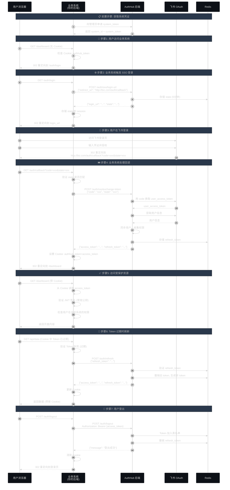

# 业务系统纯 HTTP/Curl SSO 集成指南

## 概述

本文档面向**业务系统开发者**，提供一个**不依赖任何语言或框架**的纯 HTTP/Curl 方式集成 AuthHub SSO。适用于：

- 使用不支持 SDK 的编程语言（如 Go、Rust、Ruby、PHP 等）
- 自定义框架或遗留系统
- 需要完全理解 SSO 流程的开发者
- 需要系统级权限管理的场景

## 核心概念

### 🏢 系统身份

业务系统需要在 AuthHub 中注册，获得：
- **system_id**: 系统 ID（数字）
- **system_token**: 系统 JWT Token（用于调用 AuthHub 管理接口）
- **namespace**: 系统代码（如 "data-center"）

### 🔐 两种 Token

1. **System Token** - 业务系统的身份凭证
   - 用于调用 AuthHub 管理接口
   - 长期有效（通常 1 年）
   - 由 AuthHub 管理员生成

2. **User Token** - 用户的身份凭证
   - 用户登录后获得
   - 短期有效（1 小时 access_token + 7 天 refresh_token）
   - 包含用户在当前系统的权限

## 完整集成流程



---

## 实现步骤

### 准备工作：获取系统凭证

首先，需要向 AuthHub 管理员申请系统凭证：

```bash
# 1. 管理员在 AuthHub 创建系统
# 登录 AuthHub 管理后台，创建系统:
#   - 系统名称: "数据中心"
#   - 系统代码: "data-center"

# 2. 生成系统 Token (管理员操作)
curl -X POST "http://localhost:8000/api/systems/1/generate-token" \
  -H "Authorization: Bearer ${ADMIN_TOKEN}" \
  -H "Content-Type: application/json" \
  -d '{"expires_days": 365}'

# 返回示例:
{
  "system_id": 1,
  "system_code": "data-center",
  "system_name": "数据中心",
  "system_token": "eyJhbGciOiJSUzI1NiIsInR5cCI6IkpXVCJ9.eyJzdWIiOiJkYXRhLWNlbnRlciIsInVzZXJfdHlwZSI6InN5c3RlbSIsInN5c3RlbV9uYW1lIjoi5pWw5o2u5Lit5b+DIiwiZXhwIjoxNzk0ODgzOTc3LCJpYXQiOjE3NjMzNDc5NzcsImp0aSI6InN5c3RlbV9kYXRhLWNlbnRlcl8xNzYzMzE5MTc3In0.rkqllcDUM_wjANolpBRkrpv5XHN7YpWP1MZzEO1D6TY0HF8GMDQwL0eFXABklt3Y5lFMbgmF1iY-s2ov_CHw_ruf_wxVMoBL8gI3YVW65ePpLjqVW8T5_xXwVx0NXkQq-i9-v-cDry2oJ1hwqCQbGCbvLQtIgbrgL1xdayRXsIMaueZxFwcB11vBJe6RJIdqz3Z3f07v7rfBYtCxkumVd5dTLIKzGf349TYj5MASZ-BQQyHYxGJ5-6ugPPVh_MA1pgDqkA9itRINRkSjNr6leUuM_1jz-yjKKY9z6_klAVCBCFALY2subsJ3PqVX3KIYBqhgoyNx7yZX8dj-MFp9vw",
  "expires_at": "2026-12-01T00:00:00Z"
}
```

**保存凭证**（业务系统配置文件）：
```bash
# .env 或配置文件
AUTHHUB_URL=http://localhost:8000
SYSTEM_ID=1
SYSTEM_CODE=data-center
SYSTEM_TOKEN=eyJhbGciOiJSUzI1NiIsInR5cCI6IkpXVCJ9...
```

---

### 步骤1: 检查用户登录状态

用户访问业务系统时，首先检查是否已登录：

```bash
# 伪代码逻辑（在你的业务系统后端实现）
# GET /dashboard

# 1. 检查 Cookie 中是否有 access_token
if (!cookie.authhub_token) {
    # 未登录，重定向到登录页
    redirect("/auth/login")
}

# 2. 验证 Token 是否有效
token = cookie.authhub_token
try {
    user_info = verify_jwt_token(token)  # 见步骤5
    
    # 3. 检查用户是否有当前系统的权限
    if (!has_system_permission(user_info, "data-center")) {
        return 403  # 无权访问当前系统
    }
    
    # 4. 返回页面
    return render_dashboard(user_info)
} catch (TokenExpired) {
    # Token 过期，尝试刷新（见步骤6）
    refresh_token_flow()
} catch (TokenInvalid) {
    # Token 无效，重新登录
    redirect("/auth/login")
}
```

---

### 步骤2: 触发 SSO 登录

用户未登录时，业务系统触发 SSO 登录流程：

```bash
# 业务系统后端实现
# GET /auth/login

export AUTHHUB_URL="http://localhost:8000"
export CALLBACK_URL="http://your-business-system.com/auth/callback"

# 1. 调用 AuthHub 获取登录 URL
RESPONSE=$(curl -s -X POST "${AUTHHUB_URL}/auth/sso/login-url" \
  -H "Content-Type: application/json" \
  -d "{
    \"redirect_uri\": \"${CALLBACK_URL}\"
  }")

LOGIN_URL=$(echo "$RESPONSE" | jq -r .login_url)
STATE=$(echo "$RESPONSE" | jq -r .state)

echo "登录 URL: ${LOGIN_URL}"
echo "State: ${STATE}"

# 2. 保存 state 到 session（防 CSRF）
# session.set("sso_state", STATE)

# 3. 重定向用户到飞书登录页
# redirect(LOGIN_URL)
```

**响应示例**：
```json
{
  "login_url": "https://open.feishu.cn/open-apis/authen/v1/index?app_id=cli_xxx&redirect_uri=http://your-business-system.com/auth/callback&state=abc123",
  "state": "abc123"
}
```

---

### 步骤3: 处理 SSO 回调

用户在飞书登录成功后，会重定向回业务系统：

```bash
# 业务系统后端实现
# GET /auth/callback?code=xxx&state=xxx

export AUTHHUB_URL="http://localhost:8000"

# 从 URL 参数获取
CODE="e8f7d6c5b4a3"  # 从请求参数获取
STATE="abc123"       # 从请求参数获取

# 1. 验证 state（防 CSRF）
# saved_state = session.get("sso_state")
# if (STATE != saved_state) {
#     return 400  # State 不匹配
# }

# 2. 用 code 交换 Token
TOKEN_RESPONSE=$(curl -s -X POST "${AUTHHUB_URL}/auth/sso/exchange-token" \
  -H "Content-Type: application/json" \
  -d "{
    \"code\": \"${CODE}\",
    \"state\": \"${STATE}\"
  }")

ACCESS_TOKEN=$(echo "$TOKEN_RESPONSE" | jq -r .access_token)
REFRESH_TOKEN=$(echo "$TOKEN_RESPONSE" | jq -r .refresh_token)
EXPIRES_IN=$(echo "$TOKEN_RESPONSE" | jq -r .expires_in)

echo "Access Token: ${ACCESS_TOKEN:0:50}..."
echo "Refresh Token: ${REFRESH_TOKEN:0:30}..."
echo "过期时间: ${EXPIRES_IN} 秒"

# 3. 设置 Cookie (HttpOnly, Secure, SameSite)
# Set-Cookie: authhub_token=${ACCESS_TOKEN}; HttpOnly; Secure; SameSite=Lax; Max-Age=3600
# Set-Cookie: authhub_refresh_token=${REFRESH_TOKEN}; HttpOnly; Secure; SameSite=Lax; Max-Age=604800

# 4. 清除 session 中的 state
# session.delete("sso_state")

# 5. 重定向到目标页面
# redirect("/dashboard")
```

**Token 响应示例**：
```json
{
  "access_token": "eyJhbGciOiJSUzI1NiIsInR5cCI6IkpXVCJ9...",
  "refresh_token": "aXJkN2w4ZmtkajM4ZmprZGpm...",
  "token_type": "bearer",
  "expires_in": 3600,
  "refresh_expires_in": 604800
}
```

---

### 步骤4: 解析用户 Token

从 access_token 中提取用户信息和权限：

```bash
# 方法1: 直接解析 JWT (Base64 解码)
# JWT 格式: header.payload.signature

# 提取 payload 部分
PAYLOAD=$(echo "$ACCESS_TOKEN" | cut -d'.' -f2)

# Base64 解码（需要补齐填充）
USER_INFO=$(echo "$PAYLOAD" | base64 -d 2>/dev/null | jq .)

echo "用户信息:"
echo "$USER_INFO" | jq .

# 提取关键字段
USER_ID=$(echo "$USER_INFO" | jq -r .sub)
USERNAME=$(echo "$USER_INFO" | jq -r .username)
EMAIL=$(echo "$USER_INFO" | jq -r .email)

# 提取当前系统的角色
SYSTEM_ROLES=$(echo "$USER_INFO" | jq -r '.system_roles["data-center"] // []')

echo "用户ID: ${USER_ID}"
echo "用户名: ${USERNAME}"
echo "邮箱: ${EMAIL}"
echo "当前系统角色: ${SYSTEM_ROLES}"
```

**Token Payload 示例**：
```json
{
  "sub": "1",
  "user_type": "user",
  "username": "张三",
  "email": "zhangsan@example.com",
  "dept_ids": ["od-123"],
  "dept_names": ["技术部"],
  "global_roles": ["developer"],
  "system_roles": {
    "data-center": ["admin"],
    "report-system": ["viewer"]
  },
  "global_resources": {},
  "system_resources": {
    "data-center": {
      "database": ["db-001", "db-002"]
    }
  },
  "exp": 1732276800,
  "iat": 1732273200,
  "jti": "user_1_1732273200"
}
```

---

### 步骤5: 验证 Token（本地验证）

为了提高性能，业务系统可以本地验证 JWT，无需每次都调用 AuthHub：

```bash
# 一次性操作：下载 AuthHub 公钥
curl -X GET "${AUTHHUB_URL}/auth/public-key" | jq -r .public_key > authhub_public_key.pem

echo "公钥已保存到: authhub_public_key.pem"
```

**使用公钥验证 Token（各语言示例）**：

#### Python 示例
```python
import jwt
from datetime import datetime

# 读取公钥
with open('authhub_public_key.pem', 'r') as f:
    public_key = f.read()

def verify_token(token: str) -> dict:
    """验证 JWT Token"""
    try:
        # 验证签名和过期时间
        payload = jwt.decode(
            token,
            public_key,
            algorithms=['RS256']
        )
        
        # 检查是否在黑名单（需要调用 Redis）
        # if is_token_blacklisted(payload['jti']):
        #     raise Exception("Token 已被撤销")
        
        return payload
    except jwt.ExpiredSignatureError:
        raise Exception("Token 已过期")
    except jwt.InvalidTokenError:
        raise Exception("Token 无效")

def has_system_role(user_info: dict, role: str) -> bool:
    """检查用户在当前系统是否有指定角色"""
    system_roles = user_info.get('system_roles', {}).get('data-center', [])
    return role in system_roles

def check_permission(user_info: dict, resource_type: str, resource_ids: list) -> bool:
    """检查用户是否有资源权限"""
    system_resources = user_info.get('system_resources', {}).get('data-center', {})
    allowed_ids = system_resources.get(resource_type, [])
    return any(rid in allowed_ids for rid in resource_ids)

# 使用示例
token = "eyJhbGciOiJSUzI1NiIsInR5cCI6IkpXVCJ9..."
user_info = verify_token(token)

# 权限检查
if has_system_role(user_info, 'admin'):
    print("用户是管理员")

if check_permission(user_info, 'database', ['db-001']):
    print("用户有 db-001 的权限")
```

#### Go 示例
```go
package main

import (
    "crypto/rsa"
    "fmt"
    "io/ioutil"
    "github.com/golang-jwt/jwt/v5"
)

// 读取公钥
func loadPublicKey(path string) (*rsa.PublicKey, error) {
    keyData, err := ioutil.ReadFile(path)
    if err != nil {
        return nil, err
    }
    
    publicKey, err := jwt.ParseRSAPublicKeyFromPEM(keyData)
    if err != nil {
        return nil, err
    }
    
    return publicKey, nil
}

// 验证 Token
func verifyToken(tokenString string, publicKey *rsa.PublicKey) (jwt.MapClaims, error) {
    token, err := jwt.Parse(tokenString, func(token *jwt.Token) (interface{}, error) {
        // 验证签名算法
        if _, ok := token.Method.(*jwt.SigningMethodRSA); !ok {
            return nil, fmt.Errorf("unexpected signing method: %v", token.Header["alg"])
        }
        return publicKey, nil
    })
    
    if err != nil {
        return nil, err
    }
    
    if claims, ok := token.Claims.(jwt.MapClaims); ok && token.Valid {
        return claims, nil
    }
    
    return nil, fmt.Errorf("invalid token")
}

// 检查系统角色
func hasSystemRole(claims jwt.MapClaims, role string) bool {
    systemRoles, ok := claims["system_roles"].(map[string]interface{})
    if !ok {
        return false
    }
    
    roles, ok := systemRoles["data-center"].([]interface{})
    if !ok {
        return false
    }
    
    for _, r := range roles {
        if r.(string) == role {
            return true
        }
    }
    
    return false
}

func main() {
    // 加载公钥
    publicKey, err := loadPublicKey("authhub_public_key.pem")
    if err != nil {
        panic(err)
    }
    
    // 验证 Token
    tokenString := "eyJhbGciOiJSUzI1NiIsInR5cCI6IkpXVCJ9..."
    claims, err := verifyToken(tokenString, publicKey)
    if err != nil {
        fmt.Println("Token 验证失败:", err)
        return
    }
    
    // 获取用户信息
    username := claims["username"].(string)
    fmt.Println("用户名:", username)
    
    // 检查权限
    if hasSystemRole(claims, "admin") {
        fmt.Println("用户是管理员")
    }
}
```

#### PHP 示例
```php
<?php
require 'vendor/autoload.php';

use Firebase\JWT\JWT;
use Firebase\JWT\Key;

// 读取公钥
$publicKey = file_get_contents('authhub_public_key.pem');

// 验证 Token
function verifyToken($token, $publicKey) {
    try {
        $decoded = JWT::decode($token, new Key($publicKey, 'RS256'));
        return (array) $decoded;
    } catch (Exception $e) {
        throw new Exception("Token 验证失败: " . $e->getMessage());
    }
}

// 检查系统角色
function hasSystemRole($userInfo, $role) {
    $systemRoles = $userInfo['system_roles']->{'data-center'} ?? [];
    return in_array($role, $systemRoles);
}

// 使用示例
$token = "eyJhbGciOiJSUzI1NiIsInR5cCI6IkpXVCJ9...";
$userInfo = verifyToken($token, $publicKey);

echo "用户名: " . $userInfo['username'] . "\n";

if (hasSystemRole($userInfo, 'admin')) {
    echo "用户是管理员\n";
}
?>
```

---

### 步骤6: 刷新过期 Token

当 access_token 过期时（1小时后），使用 refresh_token 获取新的令牌：

```bash
# 业务系统后端实现
# 当检测到 Token 过期时调用

export AUTHHUB_URL="http://localhost:8000"
export REFRESH_TOKEN="aXJkN2w4ZmtkajM4ZmprZGpm..."  # 从 Cookie 读取

# 1. 调用刷新接口
REFRESH_RESPONSE=$(curl -s -X POST "${AUTHHUB_URL}/auth/refresh" \
  -H "Content-Type: application/json" \
  -d "{
    \"refresh_token\": \"${REFRESH_TOKEN}\"
  }")

# 2. 检查是否成功
if [ $(echo "$REFRESH_RESPONSE" | jq -r .access_token) == "null" ]; then
    echo "❌ Refresh Token 无效或已过期，需要重新登录"
    # redirect("/auth/login")
    exit 1
fi

NEW_ACCESS_TOKEN=$(echo "$REFRESH_RESPONSE" | jq -r .access_token)
NEW_REFRESH_TOKEN=$(echo "$REFRESH_RESPONSE" | jq -r .refresh_token)

echo "✅ Token 刷新成功"
echo "新 Access Token: ${NEW_ACCESS_TOKEN:0:50}..."
echo "新 Refresh Token: ${NEW_REFRESH_TOKEN:0:30}..."

# 3. 更新 Cookie
# Set-Cookie: authhub_token=${NEW_ACCESS_TOKEN}; HttpOnly; Secure; SameSite=Lax; Max-Age=3600
# Set-Cookie: authhub_refresh_token=${NEW_REFRESH_TOKEN}; HttpOnly; Secure; SameSite=Lax; Max-Age=604800

# 4. 继续处理原请求
```

**自动刷新逻辑（伪代码）**：
```javascript
// 在请求拦截器中实现自动刷新
function handleRequest(request) {
    let token = getCookie('authhub_token');
    
    try {
        // 验证 Token
        let userInfo = verifyToken(token);
        
        // Token 即将过期（提前5分钟刷新）
        if (userInfo.exp - Date.now()/1000 < 300) {
            token = refreshToken();
        }
        
        request.headers['Authorization'] = `Bearer ${token}`;
        return processRequest(request);
        
    } catch (TokenExpiredError) {
        // Token 已过期，立即刷新
        token = refreshToken();
        request.headers['Authorization'] = `Bearer ${token}`;
        return processRequest(request);
        
    } catch (RefreshTokenExpiredError) {
        // Refresh Token 也过期了，重新登录
        return redirect('/auth/login');
    }
}
```

---

### 步骤7: 用户登出

用户登出时，需要撤销 Token：

```bash
# 业务系统后端实现
# POST /auth/logout

export AUTHHUB_URL="http://localhost:8000"
export ACCESS_TOKEN="eyJhbGciOiJSUzI1NiIsInR5cCI6IkpXVCJ9..."  # 从 Cookie 读取
export REFRESH_TOKEN="aXJkN2w4ZmtkajM4ZmprZGpm..."  # 从 Cookie 读取

# 1. 调用 AuthHub 登出接口
LOGOUT_RESPONSE=$(curl -s -X POST "${AUTHHUB_URL}/auth/logout" \
  -H "Authorization: Bearer ${ACCESS_TOKEN}" \
  -H "Content-Type: application/json" \
  -d "{
    \"refresh_token\": \"${REFRESH_TOKEN}\"
  }")

echo "登出结果:"
echo "$LOGOUT_RESPONSE" | jq .

# 2. 清除 Cookie
# Set-Cookie: authhub_token=; Max-Age=0
# Set-Cookie: authhub_refresh_token=; Max-Age=0

# 3. 清除 session
# session.clear()

# 4. 重定向到登录页
# redirect("/auth/login")
```

---

## 使用系统 Token 的高级功能

### 🔍 查询用户权限（使用 system_token）

业务系统可以使用 system_token 主动查询用户权限：

```bash
export AUTHHUB_URL="http://localhost:8000"
export SYSTEM_TOKEN="eyJhbGciOiJSUzI1NiIsInR5cCI6IkpXVCJ9..."  # 系统 Token
export USER_ID="1"

# 查询用户在当前系统的权限
curl -X GET "${AUTHHUB_URL}/api/rbac/users/${USER_ID}/permissions?system_id=1" \
  -H "Authorization: Bearer ${SYSTEM_TOKEN}" | jq .
```

**响应示例**：
```json
{
  "user_id": 1,
  "username": "张三",
  "system_roles": ["admin", "developer"],
  "permissions": [
    {
      "resource_type": "database",
      "resource_ids": ["db-001", "db-002"],
      "actions": ["read", "write"]
    }
  ]
}
```

### 🔔 订阅权限变更（使用 Redis Pub/Sub）

业务系统可以订阅权限变更通知，实时更新用户权限：

```bash
# 使用 Redis 订阅权限变更
redis-cli SUBSCRIBE "permission:data-center:*"

# 当用户权限变更时，会收到通知：
# {
#   "event": "permission_updated",
#   "user_id": 1,
#   "system_code": "data-center",
#   "roles": ["admin"],
#   "timestamp": "2024-11-21T10:00:00Z"
# }
```

**处理权限变更（伪代码）**：
```python
import redis
import json

redis_client = redis.Redis(host='localhost', port=6379)
pubsub = redis_client.pubsub()

# 订阅当前系统的权限变更
pubsub.subscribe('permission:data-center:*')

for message in pubsub.listen():
    if message['type'] == 'message':
        data = json.loads(message['data'])
        
        user_id = data['user_id']
        new_roles = data['roles']
        
        # 更新本地缓存的用户权限
        cache.update(f"user:{user_id}:roles", new_roles)
        
        # 如果用户在线，通知前端刷新权限
        websocket.send(user_id, {
            'event': 'permission_changed',
            'roles': new_roles
        })
```

---

## 完整示例代码

### 最小化业务系统实现（Python/Flask）

```python
from flask import Flask, request, redirect, make_response, jsonify
import requests
import jwt
import json

app = Flask(__name__)

# 配置
AUTHHUB_URL = "http://localhost:8000"
SYSTEM_ID = "1"
SYSTEM_CODE = "data-center"
SYSTEM_TOKEN = "eyJhbGciOiJSUzI1NiIsInR5cCI6IkpXVCJ9..."
CALLBACK_URL = "http://localhost:8001/auth/callback"

# 加载公钥（启动时执行一次）
PUBLIC_KEY = requests.get(f"{AUTHHUB_URL}/auth/public-key").json()['public_key']

def verify_token(token: str) -> dict:
    """验证 JWT Token"""
    try:
        return jwt.decode(token, PUBLIC_KEY, algorithms=['RS256'])
    except jwt.ExpiredSignatureError:
        raise Exception("Token 已过期")
    except jwt.InvalidTokenError:
        raise Exception("Token 无效")

def has_system_permission(user_info: dict) -> bool:
    """检查用户是否有当前系统的权限"""
    system_roles = user_info.get('system_roles', {})
    return SYSTEM_CODE in system_roles

@app.route('/auth/login')
def login():
    """触发 SSO 登录"""
    # 1. 获取登录 URL
    response = requests.post(f"{AUTHHUB_URL}/auth/sso/login-url", json={
        "redirect_uri": CALLBACK_URL
    })
    data = response.json()
    
    # 2. 保存 state 到 session
    session['sso_state'] = data['state']
    
    # 3. 重定向到飞书登录
    return redirect(data['login_url'])

@app.route('/auth/callback')
def callback():
    """处理 SSO 回调"""
    code = request.args.get('code')
    state = request.args.get('state')
    
    # 1. 验证 state
    if state != session.get('sso_state'):
        return "State 验证失败", 400
    
    # 2. 交换 Token
    response = requests.post(f"{AUTHHUB_URL}/auth/sso/exchange-token", json={
        "code": code,
        "state": state
    })
    tokens = response.json()
    
    # 3. 设置 Cookie
    resp = make_response(redirect('/dashboard'))
    resp.set_cookie('authhub_token', tokens['access_token'], 
                    httponly=True, samesite='Lax', max_age=3600)
    resp.set_cookie('authhub_refresh_token', tokens['refresh_token'],
                    httponly=True, samesite='Lax', max_age=604800)
    
    # 4. 清除 session
    session.pop('sso_state', None)
    
    return resp

@app.route('/dashboard')
def dashboard():
    """仪表板（需要登录）"""
    token = request.cookies.get('authhub_token')
    
    if not token:
        return redirect('/auth/login')
    
    try:
        # 验证 Token
        user_info = verify_token(token)
        
        # 检查权限
        if not has_system_permission(user_info):
            return "您没有访问当前系统的权限", 403
        
        # 返回页面
        return jsonify({
            "message": "欢迎回来",
            "user": {
                "username": user_info['username'],
                "email": user_info['email'],
                "roles": user_info['system_roles'].get(SYSTEM_CODE, [])
            }
        })
        
    except Exception as e:
        # Token 过期或无效，尝试刷新
        refresh_token = request.cookies.get('authhub_refresh_token')
        if refresh_token:
            return refresh_and_retry(refresh_token)
        else:
            return redirect('/auth/login')

@app.route('/auth/logout', methods=['POST'])
def logout():
    """登出"""
    token = request.cookies.get('authhub_token')
    refresh_token = request.cookies.get('authhub_refresh_token')
    
    # 调用 AuthHub 登出
    if token:
        requests.post(f"{AUTHHUB_URL}/auth/logout",
                     headers={"Authorization": f"Bearer {token}"},
                     json={"refresh_token": refresh_token})
    
    # 清除 Cookie
    resp = make_response(redirect('/auth/login'))
    resp.set_cookie('authhub_token', '', max_age=0)
    resp.set_cookie('authhub_refresh_token', '', max_age=0)
    
    return resp

if __name__ == '__main__':
    app.run(port=8001)
```

---

## 安全最佳实践

### 1. Cookie 安全配置

```http
Set-Cookie: authhub_token={token}; 
    HttpOnly;           # 防止 JavaScript 访问
    Secure;             # 仅 HTTPS 传输（生产环境必须）
    SameSite=Lax;       # 防止 CSRF 攻击
    Max-Age=3600;       # 1小时过期
    Path=/;             # 整个站点可用
    Domain=.example.com # 子域名共享（可选）
```

### 2. Token 刷新策略

```javascript
// 推荐：提前刷新策略
// 在 Token 还有 5 分钟过期时就开始刷新，避免用户感知

function shouldRefreshToken(token) {
    const payload = parseJwt(token);
    const expiresIn = payload.exp - Date.now() / 1000;
    return expiresIn < 300; // 小于5分钟
}

// 在中间件中实现
if (shouldRefreshToken(token)) {
    token = await refreshToken();
}
```

### 3. 权限缓存

```python
# 使用 Redis 缓存用户权限，减少 JWT 解析次数
import redis

redis_client = redis.Redis()

def get_user_permissions(user_id: int):
    # 1. 尝试从缓存读取
    cached = redis_client.get(f"user:{user_id}:permissions")
    if cached:
        return json.loads(cached)
    
    # 2. 从 Token 解析
    token = get_user_token(user_id)
    permissions = verify_token(token)
    
    # 3. 写入缓存（5分钟）
    redis_client.setex(
        f"user:{user_id}:permissions",
        300,
        json.dumps(permissions)
    )
    
    return permissions
```

### 4. CSRF 防护

```python
# 使用 state 参数防止 CSRF 攻击
import secrets

def generate_state():
    """生成随机 state"""
    state = secrets.token_urlsafe(32)
    # 存储到 session（5分钟有效）
    session['sso_state'] = state
    session['sso_state_expires'] = time.time() + 300
    return state

def verify_state(state):
    """验证 state"""
    saved_state = session.get('sso_state')
    expires = session.get('sso_state_expires', 0)
    
    if not saved_state or state != saved_state:
        raise Exception("State 不匹配")
    
    if time.time() > expires:
        raise Exception("State 已过期")
    
    # 验证通过后立即删除（一次性使用）
    session.pop('sso_state')
    session.pop('sso_state_expires')
```

---

## 故障排查

### 问题1: 回调 URL 不匹配

```bash
# 错误: redirect_uri_mismatch

# 原因: 飞书应用配置的回调地址与传入的不一致

# 解决: 在飞书开放平台配置回调地址
# 登录 https://open.feishu.cn/app
# 进入你的应用 -> 安全设置 -> 重定向 URL
# 添加: http://your-business-system.com/auth/callback
```

### 问题2: Token 验证失败

```bash
# 错误: Token 无效或签名不匹配

# 检查1: 确认使用的是正确的公钥
curl -X GET "http://localhost:8000/auth/public-key" | jq -r .public_key > public_key.pem

# 检查2: 确认 Token 格式正确（3段，用.分隔）
echo "$TOKEN" | awk -F. '{print NF}'  # 应该输出 3

# 检查3: 手动验证签名
# 访问 https://jwt.io/，粘贴 Token 和公钥
```

### 问题3: 权限不足

```bash
# 错误: 用户无法访问当前系统

# 检查1: 用户是否有当前系统的角色
curl -X GET "http://localhost:8000/auth/me" \
  -H "Authorization: Bearer ${TOKEN}" | jq '.system_roles["data-center"]'

# 检查2: 管理员是否已分配权限
# 登录 AuthHub 管理后台，检查用户的系统角色分配

# 解决: 分配系统角色
curl -X POST "http://localhost:8000/api/rbac/users/1/roles" \
  -H "Authorization: Bearer ${ADMIN_TOKEN}" \
  -H "Content-Type: application/json" \
  -d '{
    "system_id": 1,
    "role_codes": ["admin"]
  }'
```

---

## 测试用例

### Case 1: 完整登录流程

```bash
#!/bin/bash
set -e

AUTHHUB_URL="http://localhost:8000"
CALLBACK_URL="http://localhost:8001/auth/callback"

echo "🧪 测试完整登录流程"

# 1. 获取登录 URL
echo "步骤1: 获取登录 URL"
RESPONSE=$(curl -s -X POST "${AUTHHUB_URL}/auth/sso/login-url" \
  -H "Content-Type: application/json" \
  -d "{\"redirect_uri\": \"${CALLBACK_URL}\"}")

LOGIN_URL=$(echo "$RESPONSE" | jq -r .login_url)
STATE=$(echo "$RESPONSE" | jq -r .state)

echo "✅ 登录 URL: ${LOGIN_URL}"
echo "✅ State: ${STATE}"

# 2. 模拟用户登录（实际需要浏览器）
echo ""
echo "步骤2: 请在浏览器中打开以下 URL 并登录:"
echo "${LOGIN_URL}"
echo ""
read -p "登录成功后，请输入回调 URL 中的 code 参数: " CODE

# 3. 交换 Token
echo ""
echo "步骤3: 交换 Token"
TOKEN_RESPONSE=$(curl -s -X POST "${AUTHHUB_URL}/auth/sso/exchange-token" \
  -H "Content-Type: application/json" \
  -d "{\"code\": \"${CODE}\", \"state\": \"${STATE}\"}")

ACCESS_TOKEN=$(echo "$TOKEN_RESPONSE" | jq -r .access_token)
REFRESH_TOKEN=$(echo "$TOKEN_RESPONSE" | jq -r .refresh_token)

if [ "$ACCESS_TOKEN" == "null" ]; then
    echo "❌ Token 交换失败"
    echo "$TOKEN_RESPONSE" | jq .
    exit 1
fi

echo "✅ Access Token 获取成功"

# 4. 解析 Token
echo ""
echo "步骤4: 解析 Token"
PAYLOAD=$(echo "$ACCESS_TOKEN" | cut -d'.' -f2)
USER_INFO=$(echo "$PAYLOAD" | base64 -d 2>/dev/null | jq .)

echo "✅ 用户信息:"
echo "$USER_INFO" | jq '{username, email, system_roles}'

# 5. 验证权限
echo ""
echo "步骤5: 验证当前系统权限"
SYSTEM_ROLES=$(echo "$USER_INFO" | jq -r '.system_roles["data-center"] // []')

if [ "$SYSTEM_ROLES" == "[]" ]; then
    echo "❌ 用户没有当前系统的权限"
    exit 1
fi

echo "✅ 用户角色: ${SYSTEM_ROLES}"

# 6. 测试刷新
echo ""
echo "步骤6: 测试 Token 刷新"
REFRESH_RESPONSE=$(curl -s -X POST "${AUTHHUB_URL}/auth/refresh" \
  -H "Content-Type: application/json" \
  -d "{\"refresh_token\": \"${REFRESH_TOKEN}\"}")

NEW_ACCESS_TOKEN=$(echo "$REFRESH_RESPONSE" | jq -r .access_token)

if [ "$NEW_ACCESS_TOKEN" == "null" ]; then
    echo "❌ Token 刷新失败"
    exit 1
fi

echo "✅ Token 刷新成功"

# 7. 测试登出
echo ""
echo "步骤7: 测试登出"
LOGOUT_RESPONSE=$(curl -s -X POST "${AUTHHUB_URL}/auth/logout" \
  -H "Authorization: Bearer ${NEW_ACCESS_TOKEN}" \
  -H "Content-Type: application/json" \
  -d "{\"refresh_token\": \"${REFRESH_TOKEN}\"}")

echo "✅ 登出成功"

echo ""
echo "🎉 所有测试通过！"
```

---

## 参考资料

- [AuthHub Curl 用户登录教程](./curl-authentication-guide.md)
- [JWT 官方文档](https://jwt.io/)
- [OAuth 2.0 Authorization Code Flow](https://datatracker.ietf.org/doc/html/rfc6749#section-4.1)
- [飞书开放平台文档](https://open.feishu.cn/document/home/index)

---

## 更新日志

| 日期 | 版本 | 说明 |
|------|------|------|
| 2024-11-21 | v1.0 | 初始版本 |

