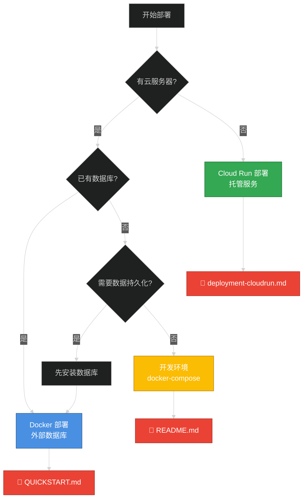

# AuthHub 部署文档

本目录包含 AuthHub 的各种部署方式文档。

## 📋 文档导航

### 快速开始

- **[快速部署指南](./QUICKSTART.md)** ⭐️ 推荐
  - 5 分钟快速部署
  - 使用外部数据库
  - 一键部署脚本

### 详细指南

- **[自建服务器完整部署指南](./self-hosted-deployment.md)**
  - Docker 部署方式
  - 源码部署方式
  - 外部数据库配置
  - Nginx 反向代理配置
  - 监控和维护
  - 性能优化建议

- **[SSL 证书配置指南](./ssl-certificate-guide.md)** ⭐️ 推荐
  - Cloudflare 免费 SSL（最简单）
  - Cloudflare Origin CA 证书
  - Let's Encrypt 自动续期
  - 自签名证书（测试用）

- **[Cloudflare + Nginx 故障排查](./cloudflare-nginx-troubleshooting.md)** 🔧
  - 重定向循环问题解决
  - upstream 错误修复
  - 完整配置模板
  - 诊断命令大全

- **[Cloud Run 部署指南](../deployment-cloudrun.md)**
  - Google Cloud Run 部署
  - 云数据库配置
  - 自动扩缩容

### 其他文档

- **[数据库连接选项](../cloudrun-db-connection-options.md)**
  - Cloud SQL 连接方式
  - Unix Socket vs TCP
  - 连接池配置

## 🎯 选择部署方式



### 部署方式对比

| 方式 | 适用场景 | 优势 | 劣势 | 文档 |
|------|---------|------|------|------|
| **Docker + 外部数据库** | 生产环境 | ✅ 灵活可控<br>✅ 成本可控<br>✅ 数据安全 | ❌ 需要运维<br>❌ 需要服务器 | [QUICKSTART.md](./QUICKSTART.md) |
| **Cloud Run** | 快速上线 | ✅ 自动扩容<br>✅ 无需运维<br>✅ 按量付费 | ❌ 依赖云服务<br>❌ 冷启动延迟 | [deployment-cloudrun.md](../deployment-cloudrun.md) |
| **源码部署** | 定制需求 | ✅ 完全控制<br>✅ 便于调试 | ❌ 配置复杂<br>❌ 维护成本高 | [self-hosted-deployment.md](./self-hosted-deployment.md) |
| **Docker Compose** | 开发测试 | ✅ 一键启动<br>✅ 环境隔离 | ❌ 不适合生产<br>❌ 性能有限 | [README.md](../../README.md) |

## 🚀 推荐部署流程

### 第一次部署（生产环境）

```bash
# 1. 克隆项目
git clone https://github.com/your-org/AuthHub.git
cd AuthHub

# 2. 运行快速部署脚本
./scripts/setup-production.sh

# 3. 按照提示完成配置
# - 配置数据库连接
# - 配置飞书应用
# - 配置域名和 CORS

# 4. 验证部署
curl http://localhost:8080/health

# 5. 配置 Nginx 反向代理
# 参考: docs/deployment/self-hosted-deployment.md#配置反向代理

# 6. 配置飞书回调地址
# https://your-domain.com/api/auth/feishu/callback
```

### 开发环境

```bash
# 后端开发
cd backend
cp .env.example .env
uv sync
python scripts/generate_keys.py
uv run alembic upgrade head
uvicorn app.main:app --reload

# 前端开发
cd frontend
pnpm install
pnpm dev
```

## 🔧 配置要求

### 最小配置（开发）

- CPU: 2 核
- 内存: 2GB
- 硬盘: 10GB
- 数据库: PostgreSQL 15+
- 缓存: Redis 7+

### 推荐配置（生产）

- CPU: 4 核
- 内存: 8GB
- 硬盘: 50GB
- 数据库: PostgreSQL 15+ (独立服务器)
- 缓存: Redis 7+ (独立服务器)
- 负载均衡: Nginx
- SSL: Let's Encrypt

### 大规模部署

- CPU: 8+ 核
- 内存: 16GB+
- 硬盘: 100GB+ SSD
- 数据库: PostgreSQL 集群
- 缓存: Redis 哨兵/集群
- 负载均衡: Nginx + 多实例
- CDN: Cloudflare/阿里云
- 监控: Prometheus + Grafana

## 📊 部署架构

### 小型部署（单机）

```
┌─────────────────────────────────────┐
│         单台服务器                    │
│  ┌──────────────────────────────┐   │
│  │  Docker: AuthHub             │   │
│  └──────────────────────────────┘   │
│  ┌──────────────────────────────┐   │
│  │  PostgreSQL                  │   │
│  └──────────────────────────────┘   │
│  ┌──────────────────────────────┐   │
│  │  Redis                       │   │
│  └──────────────────────────────┘   │
│  ┌──────────────────────────────┐   │
│  │  Nginx                       │   │
│  └──────────────────────────────┘   │
└─────────────────────────────────────┘
```

### 中型部署（分离数据库）

```
┌───────────────────┐     ┌──────────────┐
│   应用服务器       │────→│ 数据库服务器  │
│  - Docker         │     │ - PostgreSQL │
│  - AuthHub        │     │ - Redis      │
│  - Nginx          │     └──────────────┘
└───────────────────┘
```

### 大型部署（集群）

```
                  ┌─────────────────┐
                  │  负载均衡(Nginx)  │
                  └────────┬─────────┘
          ┌───────────────┼───────────────┐
          │               │               │
    ┌─────▼────┐    ┌─────▼────┐   ┌─────▼────┐
    │ AuthHub  │    │ AuthHub  │   │ AuthHub  │
    │ 实例 1    │    │ 实例 2    │   │ 实例 3    │
    └─────┬────┘    └─────┬────┘   └─────┬────┘
          └───────────────┼───────────────┘
                          │
          ┌───────────────┴───────────────┐
          │                               │
    ┌─────▼─────────┐          ┌─────────▼────┐
    │ PostgreSQL    │          │    Redis     │
    │ 主从复制       │          │    集群      │
    └───────────────┘          └──────────────┘
```

## 🔐 安全检查清单

部署前请确保：

- [ ] 数据库使用强密码（至少 16 位）
- [ ] Redis 配置密码认证
- [ ] 配置防火墙规则
- [ ] 启用 HTTPS（SSL 证书）
- [ ] 限制数据库仅内网访问
- [ ] 定期备份数据库和密钥
- [ ] 配置日志轮转
- [ ] 设置监控告警
- [ ] 更新系统安全补丁
- [ ] 禁用不必要的服务

## 📦 备份策略

### 必须备份

1. **RSA 密钥** (`keys/` 目录) - 最重要！
2. **PostgreSQL 数据库**
3. **Redis 持久化文件**
4. **环境配置** (`.env` 文件)

### 备份脚本

```bash
#!/bin/bash
BACKUP_DIR="/backup/authhub"
DATE=$(date +%Y%m%d_%H%M%S)

mkdir -p $BACKUP_DIR

# 备份数据库
pg_dump -U authhub -h localhost authhub | gzip > $BACKUP_DIR/db_$DATE.sql.gz

# 备份 Redis
redis-cli -a password save
cp /var/lib/redis/dump.rdb $BACKUP_DIR/redis_$DATE.rdb

# 备份密钥
tar -czf $BACKUP_DIR/keys_$DATE.tar.gz keys/

# 删除 7 天前的备份
find $BACKUP_DIR -type f -mtime +7 -delete
```

## 🆘 故障处理

### 常见问题

| 问题 | 可能原因 | 解决方案 | 文档 |
|------|---------|---------|------|
| 数据库连接失败 | 连接字符串错误 | 检查 DATABASE_URL | [故障排查](#) |
| Redis 连接失败 | 密码错误 | 检查 REDIS_URL | [故障排查](#) |
| 飞书回调 404 | 回调地址配置错误 | 检查飞书后台配置 | [SSO 集成](../sso-integration-guide.md) |
| CORS 错误 | 跨域配置不正确 | 更新 CORS_ORIGINS | [配置说明](#) |
| Token 失效 | 密钥文件丢失 | 恢复密钥备份 | [安全建议](#) |

### 紧急恢复

```bash
# 1. 停止服务
docker-compose -f docker-compose-production.yml down

# 2. 恢复数据库
psql -U authhub -h localhost authhub < backup.sql

# 3. 恢复密钥
tar -xzf keys-backup.tar.gz

# 4. 重启服务
docker-compose -f docker-compose-production.yml up -d
```

## 📞 获取支持

- 📖 查看文档: [docs/](../)
- 🐛 提交 Issue: [GitHub Issues](https://github.com/your-org/AuthHub/issues)
- 💬 社区讨论: [Discussions](https://github.com/your-org/AuthHub/discussions)
- 📧 邮件支持: support@your-company.com

---

祝你部署顺利！🚀

