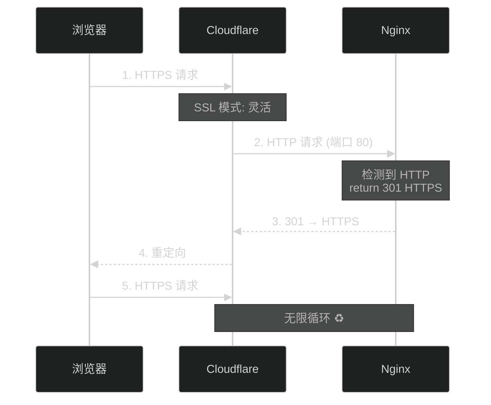

# Cloudflare + Nginx 常见问题排查

本文档总结了在使用 Cloudflare 和 Nginx 部署时的常见问题和解决方案。

## 🔥 常见问题

### 1. ERR_TOO_MANY_REDIRECTS（重定向次数过多）

#### 问题表现

```
将您重定向的次数过多。
尝试删除您的 Cookie.
ERR_TOO_MANY_REDIRECTS
```

#### 原因分析

重定向循环通常由以下原因导致：



#### 解决方案

**方案 A: 推荐配置（避免循环）**

```nginx
# ✅ 正确配置：同时监听 80 和 443
server {
    listen 80;
    listen 443 ssl http2;
    server_name your-domain.com;
    
    # Cloudflare Origin CA 证书
    ssl_certificate /etc/nginx/ssl/cloudflare-origin.crt;
    ssl_certificate_key /etc/nginx/ssl/cloudflare-origin.key;
    
    # ... 其他配置
    
    location / {
        proxy_pass http://127.0.0.1:8080;
        # ... proxy 设置
    }
}
```

**配置要点**：
- ✅ 同时监听 80 和 443 端口
- ✅ 不要在 Nginx 做 HTTP 到 HTTPS 跳转
- ✅ 让 Cloudflare 处理 HTTPS 跳转

**Cloudflare 设置**：
1. **SSL/TLS** → **概述** → 选择 **完全（严格）**
2. **SSL/TLS** → **边缘证书** → 开启 **始终使用 HTTPS**

### 2. nginx: [emerg] host not found in upstream

#### 问题表现

```bash
nginx: [emerg] host not found in upstream "authhub_backend" in /etc/nginx/conf.d/authhub.conf:30
nginx: configuration file /etc/nginx/nginx.conf test failed
```

#### 原因

1. `upstream` 块中使用了 `localhost`，但系统无法解析
2. `/etc/hosts` 文件配置不当
3. DNS 解析问题

#### 解决方案

**方案 A: 使用 IP 地址（推荐）**

```nginx
# ❌ 错误配置
upstream authhub_backend {
    server localhost:8080;
    keepalive 32;
}

location / {
    proxy_pass http://authhub_backend;
}

# ✅ 正确配置
upstream authhub_backend {
    server 127.0.0.1:8080;  # 使用 IP
    keepalive 32;
}

location / {
    proxy_pass http://authhub_backend;
}
```

**方案 B: 直接使用 IP（更简单）**

```nginx
# 不需要 upstream 块
server {
    listen 80;
    listen 443 ssl http2;
    server_name your-domain.com;
    
    location / {
        proxy_pass http://127.0.0.1:8080;  # 直接使用 IP
    }
}
```

### 3. server_name 配置不匹配

#### 问题表现

浏览器访问域名时无法正常访问，或者 Nginx 返回默认页面。

#### 原因

80 和 443 端口的 `server_name` 配置不一致：

```nginx
# ❌ 错误配置
server {
    listen 80;
    server_name authhub.cms1.cc;  # ✅ 正确
    return 301 https://$server_name$request_uri;
}

server {
    listen 443 ssl http2;
    server_name your-domain.com;  # ❌ 错误！应该是 authhub.cms1.cc
}
```

#### 解决方案

确保 `server_name` 一致：

```nginx
# ✅ 正确配置
server {
    listen 80;
    listen 443 ssl http2;
    server_name authhub.cms1.cc;  # 保持一致
    
    # ... 其他配置
}
```

## 📋 完整正确配置模板

### Nginx 配置

```nginx
# /etc/nginx/conf.d/authhub.conf

server {
    listen 80;
    listen 443 ssl http2;
    server_name authhub.cms1.cc;  # 改为你的域名
    
    # Cloudflare Origin CA 证书
    ssl_certificate /etc/nginx/ssl/cloudflare-origin.crt;
    ssl_certificate_key /etc/nginx/ssl/cloudflare-origin.key;
    
    # SSL 优化配置
    ssl_protocols TLSv1.2 TLSv1.3;
    ssl_ciphers HIGH:!aNULL:!MD5;
    ssl_prefer_server_ciphers on;
    ssl_session_cache shared:SSL:10m;
    ssl_session_timeout 10m;
    
    # 真实 IP 获取（Cloudflare）
    real_ip_header CF-Connecting-IP;
    set_real_ip_from 0.0.0.0/0;
    
    # 日志配置
    access_log /var/log/nginx/authhub-access.log;
    error_log /var/log/nginx/authhub-error.log;
    
    # 客户端上传限制
    client_max_body_size 10M;
    
    # 反向代理到 AuthHub 后端
    location / {
        proxy_pass http://127.0.0.1:8080;
        proxy_http_version 1.1;
        
        # 请求头配置
        proxy_set_header Host $host;
        proxy_set_header X-Real-IP $remote_addr;
        proxy_set_header X-Forwarded-For $proxy_add_x_forwarded_for;
        proxy_set_header X-Forwarded-Proto $scheme;
        proxy_set_header X-Forwarded-Host $host;
        proxy_set_header X-Forwarded-Port $server_port;
        
        # WebSocket 支持
        proxy_set_header Upgrade $http_upgrade;
        proxy_set_header Connection "upgrade";
        
        # 超时配置
        proxy_connect_timeout 60s;
        proxy_send_timeout 60s;
        proxy_read_timeout 60s;
    }
    
    # 健康检查端点
    location /health {
        proxy_pass http://127.0.0.1:8080/health;
        access_log off;
    }
    
    # 静态资源缓存
    location /static {
        proxy_pass http://127.0.0.1:8080/static;
        expires 1y;
        add_header Cache-Control "public, immutable";
    }
}
```

### Cloudflare 设置

1. **DNS 配置**
   - 类型：A
   - 名称：@ 或 子域名
   - 内容：服务器 IP
   - 代理状态：✅ 已代理（橙色云朵）

2. **SSL/TLS 设置**
   - **概述** → **完全（严格）**
   - **边缘证书** → ✅ 始终使用 HTTPS
   - **边缘证书** → ✅ 自动 HTTPS 重写

3. **源服务器**
   - 创建 Origin CA 证书
   - 包含你的域名（支持泛域名 `*.example.com`）
   - 有效期：15 年

## 🔍 诊断命令

### 1. 测试 Nginx 配置

```bash
# 测试配置文件语法
sudo nginx -t

# 查看配置文件位置
nginx -V 2>&1 | grep -o 'conf-path=\S*'

# 查看所有配置文件
ls -la /etc/nginx/conf.d/
ls -la /etc/nginx/sites-enabled/
```

### 2. 测试后端服务

```bash
# 测试后端是否在运行
curl http://127.0.0.1:8080/health

# 检查端口监听
netstat -tlnp | grep 8080
ss -tlnp | grep 8080

# 测试 Docker 容器
docker ps | grep authhub
docker logs authhub-backend --tail 50
```

### 3. 测试 Nginx 代理

```bash
# 测试本地 Nginx
curl -I http://localhost

# 测试 HTTPS（本地）
curl -I -k https://localhost

# 测试域名（绕过 Cloudflare）
curl -I http://服务器IP -H "Host: authhub.cms1.cc"
```

### 4. 测试 Cloudflare

```bash
# 查看完整重定向过程
curl -L -v https://authhub.cms1.cc 2>&1 | grep -E "< HTTP|< Location"

# 测试 DNS 解析
dig authhub.cms1.cc
nslookup authhub.cms1.cc

# 检查是否经过 Cloudflare
curl -I https://authhub.cms1.cc | grep -i cf-
```

### 5. 查看日志

```bash
# Nginx 访问日志
sudo tail -f /var/log/nginx/authhub-access.log

# Nginx 错误日志
sudo tail -f /var/log/nginx/authhub-error.log

# Docker 容器日志
docker logs -f authhub-backend

# 系统日志
sudo journalctl -u nginx -f
```

## 🚀 快速修复流程

### 问题：重定向循环

```bash
# 1. 编辑 Nginx 配置
sudo vi /etc/nginx/conf.d/authhub.conf

# 2. 使用推荐配置（同时监听 80 和 443）
# 移除单独的 80 端口 server 块

# 3. 测试配置
sudo nginx -t

# 4. 重载 Nginx
sudo systemctl reload nginx

# 5. 检查 Cloudflare SSL 模式
# 登录 Cloudflare → SSL/TLS → 完全（严格）
# 登录 Cloudflare → SSL/TLS → 边缘证书 → 始终使用 HTTPS

# 6. 清除浏览器缓存
# Chrome: Ctrl+Shift+Delete
# 或使用隐私模式测试

# 7. 测试访问
curl -I https://authhub.cms1.cc
```

### 问题：host not found in upstream

```bash
# 1. 编辑配置，使用 127.0.0.1
sudo vi /etc/nginx/conf.d/authhub.conf

# 2. 替换所有 localhost 为 127.0.0.1
# proxy_pass http://127.0.0.1:8080;

# 3. 测试配置
sudo nginx -t

# 4. 重载 Nginx
sudo systemctl reload nginx
```

## 📊 配置检查清单

部署前检查：

- [ ] ✅ Nginx 同时监听 80 和 443 端口
- [ ] ✅ server_name 配置正确且一致
- [ ] ✅ 使用 `127.0.0.1` 而不是 `localhost`
- [ ] ✅ 不在 Nginx 做 HTTP 到 HTTPS 跳转
- [ ] ✅ Cloudflare SSL 模式为"完全（严格）"
- [ ] ✅ Cloudflare "始终使用 HTTPS" 已开启
- [ ] ✅ Cloudflare DNS 代理状态为"已代理"（橙色云朵）
- [ ] ✅ Origin CA 证书已正确安装
- [ ] ✅ 后端服务在 8080 端口正常运行
- [ ] ✅ `real_ip_header CF-Connecting-IP` 已配置

## 🔗 相关文档

- [SSL 证书配置指南](./ssl-certificate-guide.md)
- [快速部署指南](./QUICKSTART.md)
- [完整部署指南](./self-hosted-deployment.md)

---

遇到问题？参考上面的诊断命令，或查看日志定位具体错误！🔧

