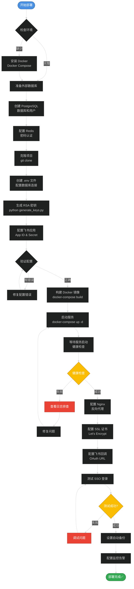
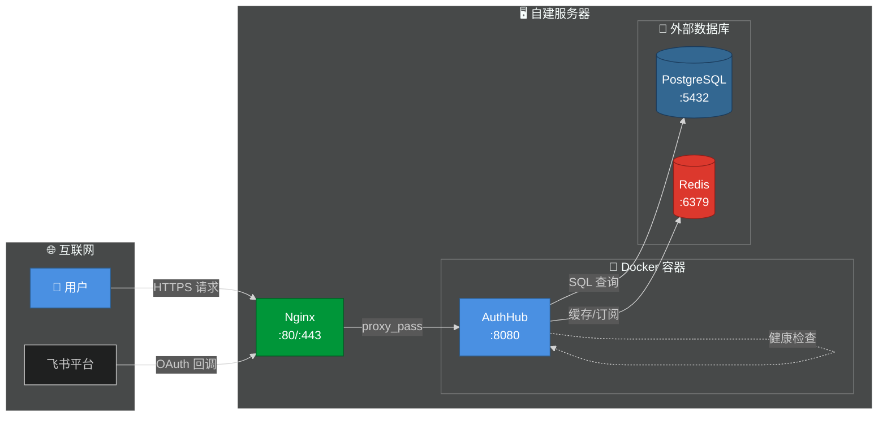
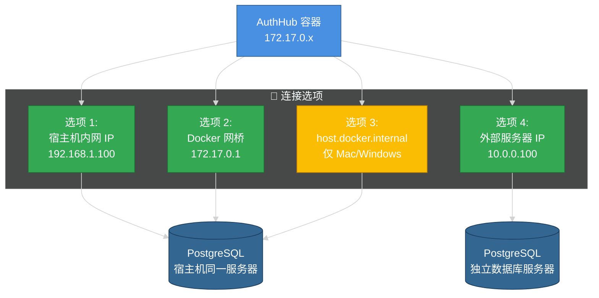
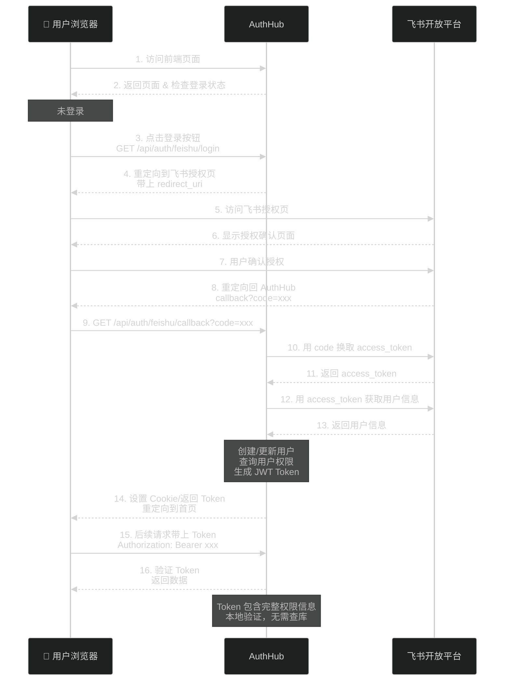
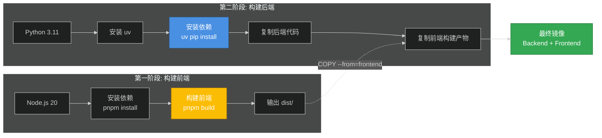
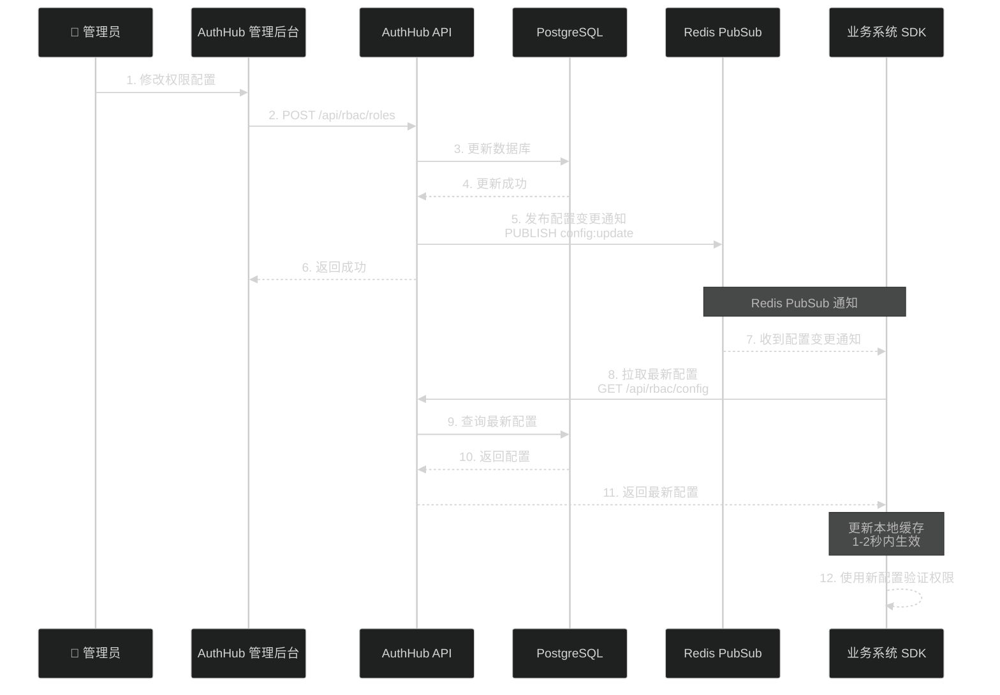
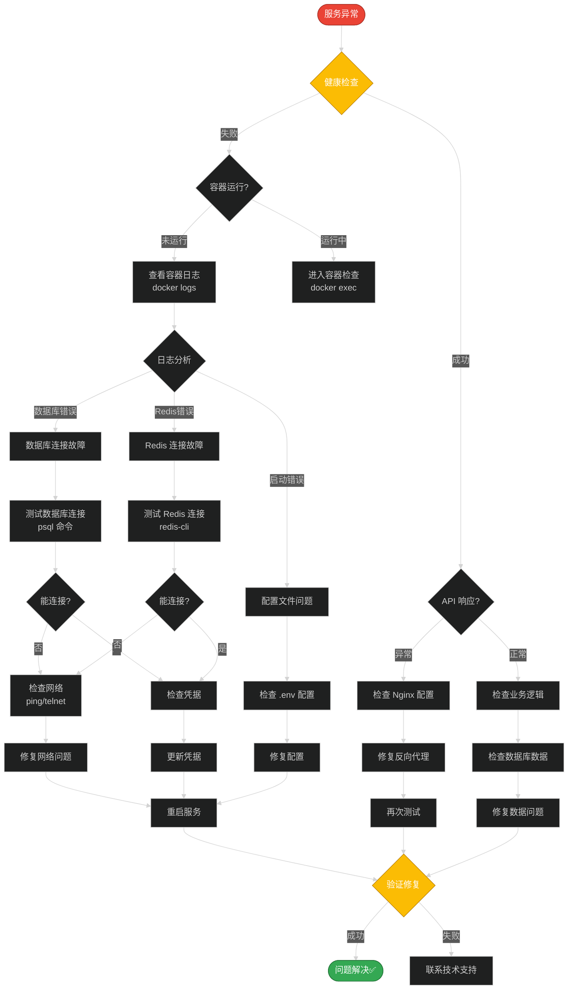
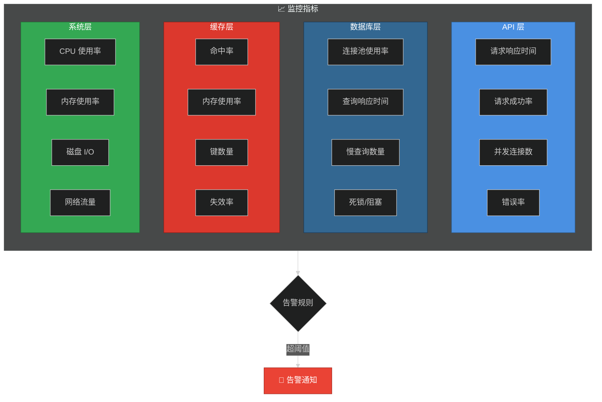
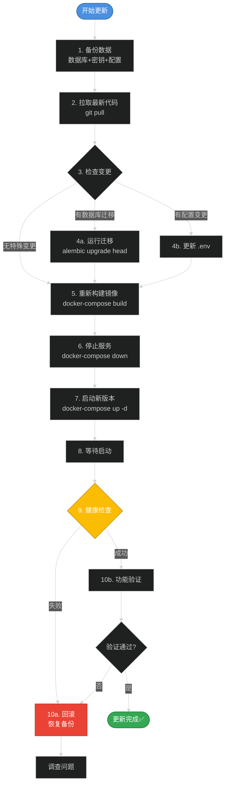

# AuthHub 部署工作流程

本文档展示 AuthHub 各种部署方式的完整工作流程。

## 🎯 生产环境部署流程（使用外部数据库）

## 🔄 网络连接关系

## 🔌 数据库连接方式

## 🔐 飞书 SSO 认证流程

## 📦 Docker 镜像构建流程

## 🔄 配置更新传播流程

## 🔧 故障排查流程

## 📊 监控指标

### 应用层监控

## 🔄 更新部署流程

## 相关文档

- [快速部署指南](./QUICKSTART.md)
- [完整部署指南](./self-hosted-deployment.md)
- [部署文档首页](./README.md)
- [架构设计](../architecture/overview.md)

---

**提示**: 所有流程图使用 Mermaid 语法，支持暗色主题，可直接在 Markdown 查看器中渲染。

