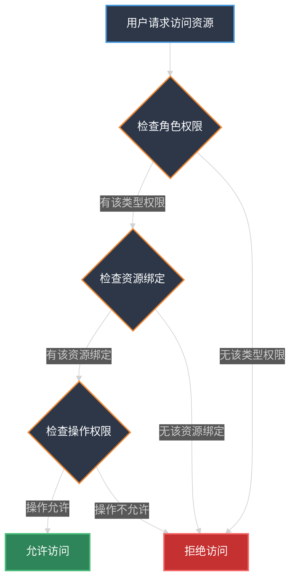
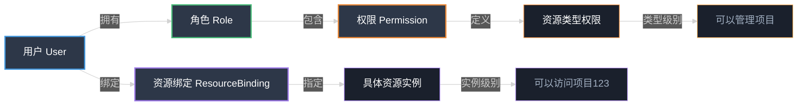

# 资源绑定使用指南

## 什么是资源绑定？

资源绑定（Resource Binding）是 AuthHub 权限管理系统中的一个核心概念，用于将用户与特定资源实例关联起来，实现**细粒度的资源级权限控制**。

## 资源绑定 vs 角色权限

### 角色权限（Role-based）
- **粗粒度控制**：基于角色定义用户可以访问哪些**类型**的资源
- **示例**：用户拥有"项目管理员"角色，可以管理所有项目

### 资源绑定（Resource-based）
- **细粒度控制**：指定用户可以访问哪些**具体**的资源实例
- **示例**：用户 A 可以访问项目 ID=123 和项目 ID=456，但不能访问项目 ID=789

## 使用场景

### 1. 多租户数据隔离
```
场景：SaaS 系统中，每个用户只能看到自己公司的数据
解决方案：
- 为用户绑定 resource_type="company", resource_id="company_123"
- 系统验证时检查用户是否有权访问该公司的数据
```

### 2. 项目/团队成员管理
```
场景：协作系统中，用户只能访问加入的项目
解决方案：
- 为用户绑定 resource_type="project", resource_ids=["proj_1", "proj_2"]
- 不同项目可以设置不同的操作权限（read/write/admin）
```

### 3. 文档权限管理
```
场景：文档系统中，文档有所有者和协作者
解决方案：
- 所有者：resource_type="document", resource_id="doc_123", action="admin"
- 协作者：resource_type="document", resource_id="doc_123", action="write"
- 查看者：resource_type="document", resource_id="doc_123", action="read"
```

## 数据结构

```typescript
interface ResourceBinding {
  id: number
  user_id: number              // 用户ID
  namespace: string            // 命名空间（global 或系统代码）
  resource_type: string        // 资源类型（如：project, team, document, company）
  resource_id: string          // 资源的唯一标识符
  system_id?: number           // 关联的系统ID（可选）
  action: string               // 操作权限（如：read, write, admin）
  created_at: string           // 创建时间
  created_by: number           // 创建人ID
}
```

## API 使用示例

### 1. 创建资源绑定（批量）

**场景**：将用户添加到多个项目中

```bash
POST /api/v1/rbac/resource-bindings
Authorization: Bearer <admin_token>

{
  "user_id": 10,
  "namespace": "project-system",
  "resource_type": "project",
  "resource_ids": ["proj_123", "proj_456", "proj_789"],
  "system_id": 1,
  "action": "write"
}
```

### 2. 查询用户的资源绑定

```bash
GET /api/v1/rbac/resource-bindings?user_id=10&namespace=project-system
Authorization: Bearer <admin_token>
```

### 3. 删除资源绑定

```bash
DELETE /api/v1/rbac/resource-bindings/{binding_id}
Authorization: Bearer <admin_token>
```

## 权限验证流程



## 实际应用示例

### 示例 1：项目协作系统

#### 1. 创建项目时自动绑定所有者

```python
# 创建项目后，绑定创建者为项目管理员
await binding_service.create_binding(
    user_id=creator_id,
    namespace="project-system",
    resource_type="project",
    resource_id=str(project.id),
    action="admin",
    created_by=creator_id
)
```

#### 2. 添加项目成员

```python
# 管理员邀请成员加入项目
await binding_service.batch_create_bindings(
    user_id=member_id,
    namespace="project-system",
    resource_type="project",
    resource_ids=[str(project.id)],
    action="write",  # 成员有读写权限
    created_by=admin_id
)
```

#### 3. 验证项目访问权限

```python
# 用户访问项目时验证
user_bindings = await binding_service.list_bindings(
    user_id=current_user_id,
    namespace="project-system"
)

accessible_project_ids = [
    b.resource_id for b in user_bindings 
    if b.resource_type == "project"
]

if project_id not in accessible_project_ids:
    raise HTTPException(status_code=403, detail="无权访问该项目")
```

### 示例 2：多租户数据隔离

```python
# 用户注册/加入公司时创建绑定
await binding_service.create_binding(
    user_id=user.id,
    namespace="global",
    resource_type="company",
    resource_id=str(company.id),
    action="member",
    created_by=admin_id
)

# 查询数据时自动过滤
user_company_bindings = await binding_service.list_bindings(
    user_id=current_user_id,
    namespace="global"
)
allowed_company_ids = [
    b.resource_id for b in user_company_bindings 
    if b.resource_type == "company"
]

# 只查询用户所属公司的数据
orders = await db.execute(
    select(Order).where(Order.company_id.in_(allowed_company_ids))
)
```

## 前端页面操作指南

### 当前功能

在权限管理页面的"资源绑定"标签页中：

1. **查看资源绑定列表**
   - 可以看到所有用户的资源绑定关系
   - 显示用户ID、命名空间、资源类型、资源ID、操作权限等信息

2. **删除资源绑定**
   - 点击"删除"按钮移除特定的资源绑定关系

### 建议改进

当前页面缺少创建资源绑定的功能，建议添加：

1. **创建资源绑定的表单**，包含：
   - 用户选择器（搜索用户）
   - 命名空间选择
   - 资源类型输入
   - 资源ID列表（支持批量）
   - 操作权限选择

2. **用户维度的资源绑定管理**
   - 在用户详情页显示该用户的所有资源绑定
   - 支持为用户添加/移除资源绑定

3. **资源维度的用户管理**
   - 查看某个资源（如项目）绑定了哪些用户
   - 批量管理资源的访问用户

## 最佳实践

### 1. 命名规范

- **资源类型**：使用单数、小写、下划线分隔（如：`project`, `team`, `document`）
- **资源ID**：使用明确的前缀（如：`proj_123`, `team_456`, `doc_789`）
- **操作权限**：使用标准动作（`read`, `write`, `admin`, `delete`）

### 2. 性能优化

- 使用索引：`user_id + namespace`、`resource_type + resource_id`
- 批量创建：一次性绑定多个资源
- 缓存：将用户的资源绑定缓存到 Redis

### 3. 安全考虑

- 仅管理员可以创建/删除资源绑定
- 记录创建人和创建时间，便于审计
- 支持过期时间（`expires_at`），实现临时访问权限

## 与权限系统的关系图



## 总结

资源绑定是实现细粒度权限控制的关键机制：

- ✅ **角色权限**决定用户能操作什么**类型**的资源
- ✅ **资源绑定**决定用户能操作哪些**具体**的资源实例
- ✅ 两者结合使用，实现灵活且安全的权限管理

建议根据业务需求，在前端添加更友好的资源绑定管理界面。

