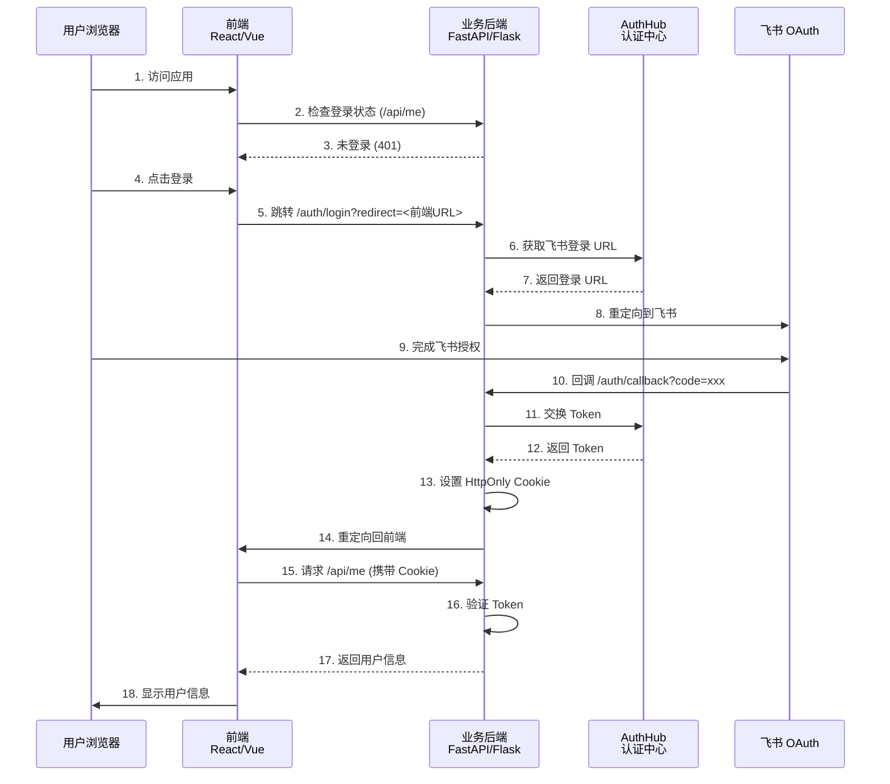

# AuthHub SDK 完全接入指南

本指南提供 AuthHub SDK 的完整接入步骤，包括前后端分离架构和传统架构的接入方式。

## 📚 目录

- [架构选择](#架构选择)
- [前后端分离架构（推荐）](#前后端分离架构推荐)
  - [后端接入 (Python/FastAPI)](#后端接入-pythonfastapi)
  - [前端接入 (React)](#前端接入-react)
  - [完整示例](#完整示例)
- [传统架构](#传统架构)
- [常见问题](#常见问题)
- [最佳实践](#最佳实践)

---

## 架构选择

### 方案对比

| 特性 | 前后端分离（推荐） | 传统架构 |
|------|------------------|---------|
| **Token 存储** | HttpOnly Cookie (后端) | localStorage (前端) |
| **安全性** | ⭐⭐⭐⭐⭐ | ⭐⭐⭐ |
| **OAuth 处理** | 后端 | 前端 |
| **前端复杂度** | 低（~100行） | 中（~500行） |
| **适用场景** | 前后端分离应用 | 纯前端应用 |

### 推荐方案

**前后端分离架构**：更安全、更简单、更符合现代开发实践。

---

## 前后端分离架构（推荐）

这种架构中，OAuth 流程完全由后端处理，前端只需要一个简单的 Hook。

### 架构图



---

## 后端接入 (Python/FastAPI)

### 1. 安装依赖

```bash
pip install authhub-sdk[fastapi]
```

或使用 Poetry：

```bash
poetry add authhub-sdk[fastapi]
```

### 2. 初始化 AuthHub 客户端

```python
from fastapi import FastAPI
from authhub_sdk import AuthHubClient

app = FastAPI()

# 初始化 AuthHub 客户端
authhub_client = AuthHubClient(
    authhub_url="http://localhost:8000",  # AuthHub 服务地址
    system_id="1",                         # 在 AuthHub 中注册的系统 ID
    system_token="your_system_token",      # 系统 Token
    namespace="your-system",               # 系统命名空间
    redis_url="redis://localhost:6379/0",  # Redis 连接（用于缓存）
)
```

**获取系统凭证**：
1. 访问 AuthHub 管理后台
2. 创建或选择系统
3. 复制系统 ID 和 Token

### 3. 配置 CORS（前后端分离必需）

```python
from fastapi.middleware.cors import CORSMiddleware

# 配置 CORS - 允许前端跨域访问
app.add_middleware(
    CORSMiddleware,
    allow_origins=[
        "http://localhost:3000",   # React 开发环境
        "http://localhost:5173",   # Vite 开发环境
        "http://localhost:8080",   # Vue 开发环境
        # "https://your-frontend.com",  # 生产环境
    ],
    allow_credentials=True,  # ⚠️ 必须！允许携带 Cookie
    allow_methods=["*"],
    allow_headers=["*"],
)
```

### 4. 集成 SSO 中间件（一行代码）

```python
from authhub_sdk.middleware.fastapi_sso import setup_sso

# 一行代码完成 SSO 集成
setup_sso(
    app,
    client=authhub_client,
    callback_path="/auth/callback",    # SSO 回调路径
    login_path="/auth/login",          # 登录触发路径
    logout_path="/auth/logout",        # 登出路径
    cookie_name="authhub_token",       # Cookie 名称
    cookie_secure=False,               # 开发环境 False，生产 True
    cookie_httponly=True,              # 防止 XSS 攻击
    cookie_samesite="lax",             # 防止 CSRF 攻击
    cookie_max_age=3600,               # Cookie 过期时间（秒）
    public_routes=[                    # 公开路由（无需登录）
        "/health",
        "/docs",
        "/openapi.json",
    ],
    login_required=True,               # 是否要求登录
    redirect_to_login=True,            # 未登录时是否重定向到登录页
)
```

### 5. 添加用户信息接口

```python
from fastapi import Request, HTTPException

@app.get("/api/me")
async def get_current_user(request: Request):
    """
    获取当前登录用户信息
    
    中间件会自动验证 Token 并注入 request.state.user
    """
    user = request.state.user
    
    return {
        "sub": user.get("sub"),
        "username": user.get("username"),
        "email": user.get("email"),
        "global_roles": user.get("global_roles", []),
        "system_roles": user.get("system_roles", {}),
    }
```

**重要**：`/api/me` 不要添加到 `public_routes`，让中间件验证 Token。

### 6. 配置飞书回调地址

在飞书开放平台配置回调地址：

```
开发环境: http://127.0.0.1:8001/auth/callback
生产环境: https://api.your-domain.com/auth/callback
```

**注意**：
- 使用 `127.0.0.1` 而不是 `localhost`
- 端口号要与后端服务一致
- 必须是完整的 URL

### 7. 启动服务

```python
if __name__ == "__main__":
    import uvicorn
    
    # 使用 127.0.0.1 保证与飞书回调地址一致
    uvicorn.run(app, host="127.0.0.1", port=8001)
```

---

## 前端接入 (React)

### 1. 安装依赖

```bash
npm install axios react-router-dom
# 或
pnpm install axios react-router-dom
```

### 2. 创建认证客户端

创建 `src/lib/auth-client.ts`：

```typescript
import { useState, useEffect, useCallback } from 'react';
import axios from 'axios';

export interface User {
  sub: string;
  username: string;
  email?: string;
  global_roles?: string[];
  system_roles?: Record<string, string[]>;
}

export interface UseAuthOptions {
  backendUrl: string;      // 后端地址
  loginPath?: string;      // 登录路径，默认 /auth/login
  logoutPath?: string;     // 登出路径，默认 /auth/logout
  mePath?: string;         // 用户信息路径，默认 /api/me
}

export interface UseAuthResult {
  user: User | null;
  loading: boolean;
  isAuthenticated: boolean;
  login: (returnUrl?: string) => void;
  logout: () => Promise<void>;
  refresh: () => Promise<void>;
}

class AuthClient {
  private config: Required<UseAuthOptions>;

  constructor(config: UseAuthOptions) {
    this.config = {
      backendUrl: config.backendUrl.replace(/\/$/, ''),
      loginPath: config.loginPath || '/auth/login',
      logoutPath: config.logoutPath || '/auth/logout',
      mePath: config.mePath || '/api/me',
    };
  }

  login(returnUrl?: string): void {
    const url = new URL(this.config.loginPath, this.config.backendUrl);
    if (returnUrl) {
      // 将相对路径转换为完整的前端 URL
      const fullReturnUrl = returnUrl.startsWith('http')
        ? returnUrl
        : window.location.origin + returnUrl;
      // ⚠️ 重要：参数名必须是 'redirect'
      url.searchParams.set('redirect', fullReturnUrl);
    }
    window.location.href = url.toString();
  }

  async logout(): Promise<void> {
    try {
      await axios.post(
        `${this.config.backendUrl}${this.config.logoutPath}`,
        {},
        { withCredentials: true }
      );
    } catch (error) {
      console.error('Logout failed:', error);
    }
  }

  async getCurrentUser(): Promise<User | null> {
    try {
      const response = await axios.get(
        `${this.config.backendUrl}${this.config.mePath}`,
        { withCredentials: true }  // ⚠️ 必须！携带 Cookie
      );
      return response.data;
    } catch (error: any) {
      if (error.response?.status === 401) {
        return null;
      }
      console.error('Get current user failed:', error);
      return null;
    }
  }
}

export function useAuth(options: UseAuthOptions): UseAuthResult {
  const [client] = useState(() => new AuthClient(options));
  const [user, setUser] = useState<User | null>(null);
  const [loading, setLoading] = useState(true);

  const refresh = useCallback(async () => {
    try {
      const currentUser = await client.getCurrentUser();
      setUser(currentUser);
    } catch (error) {
      console.error('Failed to refresh user:', error);
      setUser(null);
    }
  }, [client]);

  useEffect(() => {
    const init = async () => {
      setLoading(true);
      await refresh();
      setLoading(false);
    };
    init();
  }, [refresh]);

  const login = useCallback(
    (returnUrl?: string) => {
      client.login(returnUrl || window.location.pathname);
    },
    [client]
  );

  const logout = useCallback(async () => {
    await client.logout();
    setUser(null);
  }, [client]);

  return {
    user,
    loading,
    isAuthenticated: user !== null,
    login,
    logout,
    refresh,
  };
}
```

### 3. 配置后端地址

创建 `src/config.ts`：

```typescript
export const BACKEND_URL = 'http://localhost:8001';  // 开发环境
// export const BACKEND_URL = 'https://api.your-domain.com';  // 生产环境
```

### 4. 创建页面组件

#### 登录页面 (`src/pages/Login.tsx`)

```tsx
import React from 'react';
import { useAuth } from '../lib/auth-client';
import { BACKEND_URL } from '../config';

function Login() {
  const { login, loading } = useAuth({ backendUrl: BACKEND_URL });

  const handleLogin = () => {
    login('/dashboard');  // 登录成功后跳转到 /dashboard
  };

  return (
    <div>
      <h1>欢迎使用 AuthHub</h1>
      <button onClick={handleLogin} disabled={loading}>
        {loading ? '加载中...' : '使用飞书登录'}
      </button>
    </div>
  );
}

export default Login;
```

#### 回调页面 (`src/pages/Callback.tsx`)

```tsx
import React, { useEffect } from 'react';
import { useNavigate } from 'react-router-dom';

function Callback() {
  const navigate = useNavigate();

  useEffect(() => {
    // 后端已经处理了回调和 Cookie 设置，直接跳转到 dashboard
    navigate('/dashboard', { replace: true });
  }, [navigate]);

  return (
    <div>
      <p>登录中...</p>
    </div>
  );
}

export default Callback;
```

#### Dashboard 页面 (`src/pages/Dashboard.tsx`)

```tsx
import React, { useEffect } from 'react';
import { useAuth } from '../lib/auth-client';
import { useNavigate } from 'react-router-dom';
import { BACKEND_URL } from '../config';

function Dashboard() {
  const { user, logout, isAuthenticated, loading } = useAuth({ 
    backendUrl: BACKEND_URL 
  });
  const navigate = useNavigate();

  useEffect(() => {
    if (!loading && !isAuthenticated) {
      navigate('/login');
    }
  }, [loading, isAuthenticated, navigate]);

  if (loading) {
    return <div>加载中...</div>;
  }

  if (!user) {
    return null;
  }

  const handleLogout = async () => {
    await logout();
    navigate('/login');
  };

  return (
    <div>
      <h1>Dashboard</h1>
      <div>
        <p>用户名: {user.username}</p>
        <p>邮箱: {user.email || '未设置'}</p>
        <p>用户ID: {user.sub}</p>
        <p>角色: {user.global_roles?.join(', ') || '无'}</p>
      </div>
      <button onClick={handleLogout}>登出</button>
    </div>
  );
}

export default Dashboard;
```

### 5. 配置路由

创建 `src/App.tsx`：

```tsx
import React from 'react';
import { BrowserRouter, Routes, Route, Navigate } from 'react-router-dom';
import Login from './pages/Login';
import Dashboard from './pages/Dashboard';
import Callback from './pages/Callback';

function App() {
  return (
    <BrowserRouter>
      <Routes>
        <Route path="/login" element={<Login />} />
        <Route path="/auth/callback" element={<Callback />} />
        <Route path="/dashboard" element={<Dashboard />} />
        <Route path="/" element={<Navigate to="/dashboard" replace />} />
      </Routes>
    </BrowserRouter>
  );
}

export default App;
```

### 6. 启动开发服务器

```bash
npm run dev
# 或
pnpm dev
```

访问 `http://localhost:5173`（Vite）或 `http://localhost:3000`（CRA）

---

## 完整示例

### 完整的后端代码

```python
"""FastAPI SSO 集成示例"""

from fastapi import FastAPI, Request, HTTPException
from fastapi.middleware.cors import CORSMiddleware
from authhub_sdk import AuthHubClient
from authhub_sdk.middleware.fastapi_sso import setup_sso

# 创建 FastAPI 应用
app = FastAPI(title="My App with AuthHub")

# 配置 CORS
app.add_middleware(
    CORSMiddleware,
    allow_origins=["http://localhost:5173"],
    allow_credentials=True,
    allow_methods=["*"],
    allow_headers=["*"],
)

# 初始化 AuthHub 客户端
authhub_client = AuthHubClient(
    authhub_url="http://localhost:8000",
    system_id="1",
    system_token="your_system_token",
    namespace="my-app",
    redis_url="redis://localhost:6379/0",
)

# 集成 SSO
setup_sso(
    app,
    client=authhub_client,
    callback_path="/auth/callback",
    login_path="/auth/login",
    logout_path="/auth/logout",
    cookie_name="authhub_token",
    cookie_secure=False,
    cookie_httponly=True,
    cookie_samesite="lax",
    cookie_max_age=3600,
    public_routes=["/health", "/docs", "/openapi.json"],
)

# 健康检查
@app.get("/health")
async def health():
    return {"status": "ok"}

# 用户信息接口
@app.get("/api/me")
async def get_current_user(request: Request):
    user = request.state.user
    return {
        "sub": user.get("sub"),
        "username": user.get("username"),
        "email": user.get("email"),
        "global_roles": user.get("global_roles", []),
        "system_roles": user.get("system_roles", {}),
    }

# 业务接口示例
@app.get("/api/data")
async def get_data(request: Request):
    user = request.state.user
    # 可以使用 user 信息进行业务逻辑处理
    return {"data": "some data", "user": user.get("username")}

if __name__ == "__main__":
    import uvicorn
    uvicorn.run(app, host="127.0.0.1", port=8001)
```

### 项目结构

```
my-project/
├── backend/                    # 后端
│   ├── app.py                  # FastAPI 应用
│   ├── requirements.txt        # Python 依赖
│   └── .env                    # 环境变量
│
└── frontend/                   # 前端
    ├── src/
    │   ├── lib/
    │   │   └── auth-client.ts  # 认证客户端
    │   ├── pages/
    │   │   ├── Login.tsx       # 登录页
    │   │   ├── Callback.tsx    # 回调页
    │   │   └── Dashboard.tsx   # 仪表板
    │   ├── config.ts           # 配置
    │   └── App.tsx             # 应用入口
    ├── package.json
    └── tsconfig.json
```

---

## 常见问题

### 1. 登录后跳转到后端页面

**问题**: 点击登录后，最终停留在 `http://localhost:8001/dashboard`

**原因**: 
- 前端参数名使用错误（应该是 `redirect` 不是 `return_url`）
- 或者传递了相对路径而不是完整 URL

**解决**:
```typescript
// ❌ 错误
url.searchParams.set('return_url', '/dashboard');

// ✅ 正确
const fullUrl = window.location.origin + '/dashboard';
url.searchParams.set('redirect', fullUrl);
```

### 2. /api/me 返回 401

**问题**: 前端调用 `/api/me` 总是返回 401

**可能原因**:
1. `/api/me` 被错误地添加到 `public_routes` 中
2. 前端请求没有带 `withCredentials: true`
3. CORS 没有配置 `allow_credentials=True`

**解决**:

后端：
```python
# ❌ 错误：不要将 /api/me 加入公开路由
public_routes=["/health", "/api/me"]

# ✅ 正确
public_routes=["/health"]
```

前端：
```typescript
// ✅ 必须带 withCredentials
axios.get(url, { withCredentials: true })
```

### 3. CORS 错误

**问题**: 浏览器控制台显示 CORS 错误

**解决**:
```python
app.add_middleware(
    CORSMiddleware,
    allow_origins=["http://localhost:5173"],  # 前端地址
    allow_credentials=True,  # ⚠️ 必须！
    allow_methods=["*"],
    allow_headers=["*"],
)
```

**注意**:
- `allow_origins` 必须精确匹配前端地址（包括端口）
- `allow_credentials` 必须为 `True`
- 前端请求必须带 `withCredentials: true`

### 4. Cookie 未设置

**调试步骤**:

1. 打开浏览器开发者工具
2. Application → Cookies → `http://localhost:8001`
3. 检查是否有 `authhub_token`

如果没有：
- 检查后端日志是否有错误
- 访问 `http://localhost:8001/auth/callback` 手动测试
- 检查飞书回调地址配置是否正确

### 5. Token 过期问题

**现象**: 登录一段时间后自动退出

**原因**: Token 过期

**解决**: SDK 已内置自动刷新机制，无需额外处理。如需调整过期时间：

```python
setup_sso(
    app,
    cookie_max_age=7200,  # 2小时
    ...
)
```

---

## 最佳实践

### 1. 环境变量管理

后端 (`.env`)：
```env
AUTHHUB_URL=http://localhost:8000
SYSTEM_ID=1
SYSTEM_TOKEN=your_token_here
REDIS_URL=redis://localhost:6379/0
FRONTEND_URL=http://localhost:5173
```

前端 (`.env`):
```env
VITE_BACKEND_URL=http://localhost:8001
```

### 2. 生产环境配置

后端：
```python
setup_sso(
    app,
    cookie_secure=True,        # HTTPS 环境必须
    cookie_httponly=True,      # 防止 XSS
    cookie_samesite="lax",     # 防止 CSRF
    cookie_max_age=3600,       # 1小时
)

# CORS 配置
app.add_middleware(
    CORSMiddleware,
    allow_origins=["https://app.your-domain.com"],
    allow_credentials=True,
    allow_methods=["*"],
    allow_headers=["*"],
)
```

前端：
```typescript
export const BACKEND_URL = import.meta.env.VITE_BACKEND_URL 
  || 'https://api.your-domain.com';
```

### 3. 错误处理

前端：
```typescript
try {
  const user = await client.getCurrentUser();
  setUser(user);
} catch (error) {
  if (axios.isAxiosError(error) && error.response?.status === 401) {
    // 未登录，跳转到登录页
    navigate('/login');
  } else {
    // 其他错误，显示错误信息
    console.error('获取用户信息失败:', error);
  }
}
```

后端：
```python
from fastapi import HTTPException

@app.get("/api/data")
async def get_data(request: Request):
    try:
        user = request.state.user
        # 业务逻辑
        return {"data": "..."}
    except Exception as e:
        raise HTTPException(status_code=500, detail=str(e))
```

### 4. 权限检查

```python
from fastapi import HTTPException

@app.post("/api/documents")
async def create_document(request: Request):
    user = request.state.user
    
    # 检查权限
    if not authhub_client.check_permission(user, "document", "write"):
        raise HTTPException(status_code=403, detail="权限不足")
    
    # 业务逻辑
    return {"message": "创建成功"}
```

### 5. 日志记录

```python
import logging

logger = logging.getLogger(__name__)

@app.get("/api/me")
async def get_current_user(request: Request):
    user = request.state.user
    logger.info(f"用户 {user.get('username')} 访问了用户信息接口")
    return user
```

---

## 相关文档

- [SSO 集成指南](../sso-integration-guide.md) - 详细的 SSO 集成说明
- [React SSO 修复文档](./react-sso-redirect-fix.md) - 登录重定向问题修复
- [修复清单](./react-sso-fix-checklist.md) - 常见问题和解决方案
- [Python SDK 文档](../../sdk/python/README.md) - Python SDK API 文档
- [TypeScript SDK 文档](../../sdk/typescript/README.md) - TypeScript SDK API 文档

---

## 获取帮助

- 查看示例代码：`sdk/python/examples/` 和 `sdk/typescript/examples/`
- 提交 Issue：GitHub Issues
- 查看文档：`docs/` 目录

---

**最后更新**: 2025-11-17  
**版本**: 1.0.0

