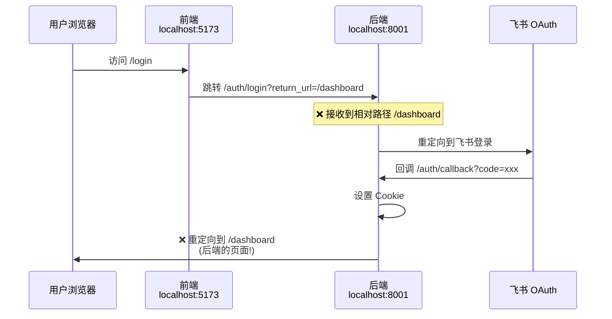
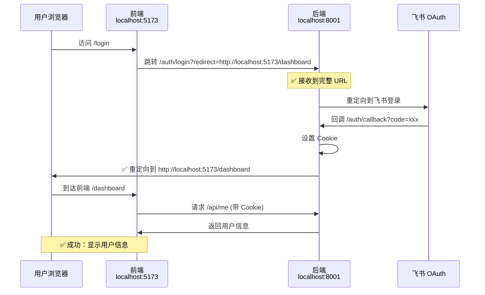

# React SSO 示例 - 登录重定向修复

## 问题描述

React SSO 示例在登录成功后，会跳转到后端的 `http://localhost:8001/dashboard` 页面，而不是前端的 `http://localhost:5173/dashboard` 页面。

## 问题原因

### 主要问题

1. **参数名不匹配**：前端使用 `return_url`，但后端期望 `redirect`
2. **相对路径问题**：前端传递相对路径 `/dashboard`，后端当作后端路径处理
3. **接口配置错误**：`/api/me` 被错误加入公开路由，导致中间件不验证 Token

### 登录流程



## 解决方案

需要修改前端和后端代码。

### 1. 修改前端 - 参数名和完整 URL

**文件**：`sdk/typescript/examples/react-sso/src/lib/auth-client.ts`

**关键修改**：
1. 参数名从 `return_url` 改为 `redirect`
2. 将相对路径转换为完整 URL

```typescript
login(returnUrl?: string): void {
  const url = new URL(this.config.loginPath, this.config.backendUrl);
  if (returnUrl) {
    // 将相对路径转换为完整的前端 URL
    const fullReturnUrl = returnUrl.startsWith('http')
      ? returnUrl
      : window.location.origin + returnUrl;
    // ⚠️ 重要：后端期望的参数名是 'redirect' 而不是 'return_url'
    url.searchParams.set('redirect', fullReturnUrl);
  }
  window.location.href = url.toString();
}
```

### 修复后的流程



## 后端配置

**文件**：`sdk/python/examples/fastapi_sso_example.py`

### 1. 添加 CORS 支持

```python
from fastapi.middleware.cors import CORSMiddleware

# 配置CORS - 允许前端访问
app.add_middleware(
    CORSMiddleware,
    allow_origins=["http://localhost:5173"],  # 前端地址
    allow_credentials=True,  # ⚠️ 重要！允许携带 Cookie
    allow_methods=["*"],
    allow_headers=["*"],
)
```

### 2. 添加 /api/me 接口

```python
@app.get("/api/me")
async def get_current_user(request: Request):
    """获取当前登录用户信息(前端需要)"""
    # 中间件已经验证了 Token，直接使用 request.state.user
    user = request.state.user
    
    return {
        "sub": user.get("sub"),
        "username": user.get("username"),
        "email": user.get("email"),
        "global_roles": user.get("global_roles", []),
        "system_roles": user.get("system_roles", {}),
    }
```

### 3. **重要：不要将 /api/me 添加到公开路由**

```python
setup_sso(
    app,
    client=authhub_client,
    # ❌ 错误：不要将 /api/me 加入公开路由
    # public_routes=["/health", "/docs", "/openapi.json", "/api/me"],
    
    # ✅ 正确：让中间件验证 Token
    public_routes=["/health", "/docs", "/openapi.json"],
    ...
)
```

**原因**：
- 如果 `/api/me` 在公开路由中，中间件会跳过 Token 验证
- 跳过验证后，`request.state.user` 不会被设置
- 接口返回 401 错误

### 4. /api/me 接口实现

```python
@app.get("/api/me")
async def get_current_user(request: Request):
    """获取当前登录用户信息(前端需要)"""
    # 中间件已经验证了 Token，直接使用 request.state.user
    user = request.state.user
    
    return {
        "sub": user.get("sub"),
        "username": user.get("username"),
        "email": user.get("email"),
        "global_roles": user.get("global_roles", []),
        "system_roles": user.get("system_roles", {}),
    }
```

## 测试步骤

### 1. 启动 AuthHub 服务

```bash
cd backend
uvicorn app.main:app --port 8000
```

### 2. 启动后端服务

```bash
cd sdk/python/examples
python fastapi_sso_example.py
```

### 3. 启动前端服务

```bash
cd sdk/typescript/examples/react-sso
pnpm install  # 或 npm install
pnpm dev      # 或 npm run dev
```

### 4. 测试登录

1. 访问 `http://localhost:5173`
2. 点击"使用飞书登录"
3. 完成飞书授权
4. ✅ 应该跳转回 `http://localhost:5173/dashboard` 并显示用户信息

## 验证清单

- [ ] 登录后 URL 是 `http://localhost:5173/dashboard`（不是 8001）
- [ ] Dashboard 页面显示用户信息
- [ ] 浏览器控制台无 CORS 错误
- [ ] Cookie 正常设置（可在开发者工具查看）
- [ ] 刷新页面后仍保持登录状态

## 相关文件

- 前端修改：`sdk/typescript/examples/react-sso/src/lib/auth-client.ts`
- 后端修改：`sdk/python/examples/fastapi_sso_example.py`
- 后端中间件：`sdk/python/authhub_sdk/middleware/fastapi_sso.py`

## 注意事项

### 生产环境配置

1. **CORS 配置**：使用实际的前端域名
```python
allow_origins=["https://your-frontend-domain.com"]
```

2. **Cookie 安全**：
```python
cookie_secure=True,  # HTTPS 环境
```

3. **飞书回调地址**：配置为生产环境地址
```
https://your-backend-domain.com/auth/callback
```

### 开发环境特别说明

- 使用 `127.0.0.1` 而不是 `localhost` 可避免某些浏览器的 Cookie 问题
- 确保飞书应用配置的回调地址与后端地址一致
- `cookie_samesite="lax"` 适合大多数场景

## 修复总结

这次修复解决了三个关键问题：

### 1. **参数名不匹配** ❌ → ✅
- **问题**：前端使用 `return_url`，后端期望 `redirect`
- **修复**：前端改用 `redirect` 参数
- **影响**：URL 参数能正确传递到后端

### 2. **相对路径变完整 URL** ❌ → ✅
- **问题**：前端传 `/dashboard`，后端理解为 `http://localhost:8001/dashboard`
- **修复**：前端转换为 `http://localhost:5173/dashboard`
- **影响**：登录后正确跳转回前端

### 3. **/api/me 路由配置** ❌ → ✅
- **问题**：`/api/me` 在公开路由中，中间件不验证 Token
- **修复**：移除公开路由，让中间件验证并注入 `request.state.user`
- **影响**：前端能正确获取用户信息

### 4. **CORS 跨域支持** ➕
- **新增**：后端添加 CORS 中间件
- **配置**：`allow_credentials=True` 允许跨域携带 Cookie
- **影响**：前端能跨域调用后端 API

## 完整流程

修复后，实现了标准的前后端分离 SSO 流程：

1. 前端传递完整 URL（含前端域名）
2. 后端设置 HttpOnly Cookie
3. 后端重定向回前端
4. 前端自动携带 Cookie 调用 API
5. 后端验证 Token 并返回用户信息

**安全性**：Token 存储在 HttpOnly Cookie 中，JavaScript 无法访问，有效防止 XSS 攻击。

