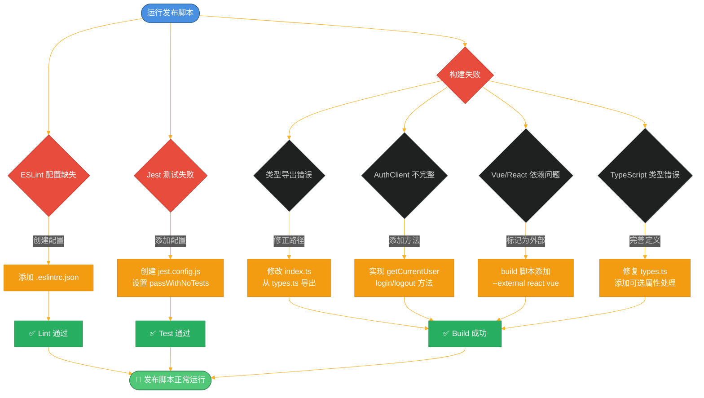
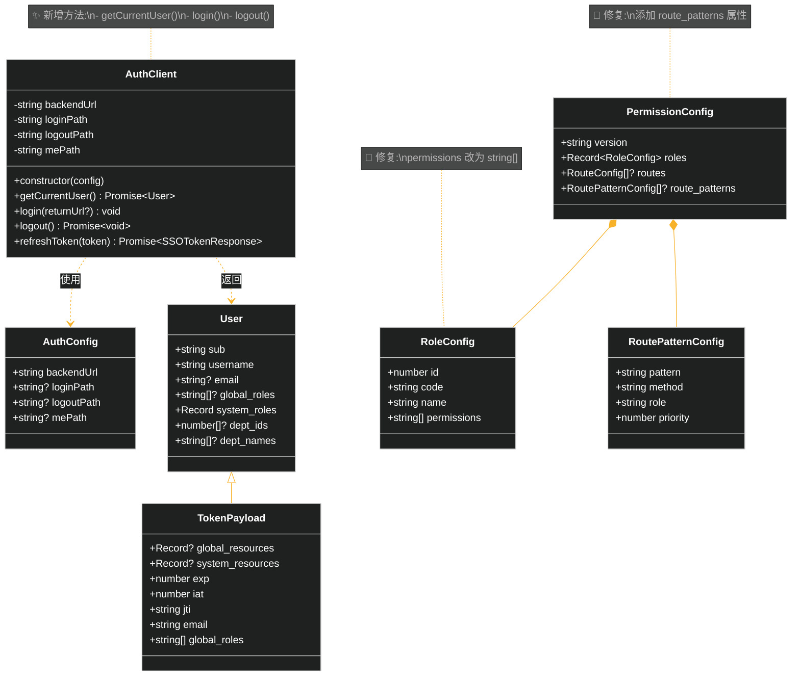
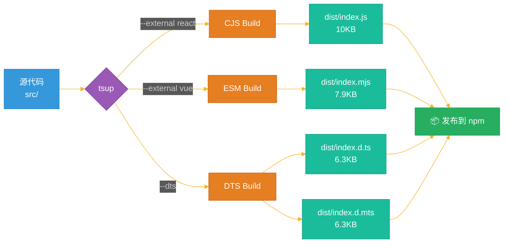

# TypeScript SDK 构建修复流程图

## 问题与修复流程



## 类型修复详情



## 构建流程



## 修复前后对比

| 问题 | 修复前 | 修复后 |
|------|--------|--------|
| **ESLint** | ❌ 找不到配置文件 | ✅ 配置完整,可正常运行 |
| **Jest** | ❌ 无测试时失败 | ✅ `passWithNoTests: true` |
| **类型导出** | ❌ 从错误模块导出 | ✅ 从 `types.ts` 正确导出 |
| **AuthClient** | ❌ 缺少关键方法 | ✅ 实现完整的前端 API |
| **React/Vue** | ❌ 尝试打包进 bundle | ✅ 标记为 external |
| **RoleConfig.permissions** | ❌ `PermissionItem[]` | ✅ `string[]` |
| **PermissionConfig** | ❌ 缺少 `route_patterns` | ✅ 添加可选属性 |
| **可选属性处理** | ❌ 直接访问可能 undefined | ✅ 添加空值检查 |
| **构建结果** | ❌ 构建失败 | ✅ 成功生成 4 个文件 |

## 关键代码变更

### 1. AuthClient 构造函数

```typescript
// 修复前
constructor(authhubUrl: string)

// 修复后
constructor(config: string | AuthConfig) // 支持两种方式
```

### 2. 可选属性处理

```typescript
// 修复前
const userRoles = tokenPayload.system_roles[this.namespace] || [];

// 修复后
const systemRoles = tokenPayload.system_roles || {};
const userRoles = systemRoles[this.namespace] || [];
```

### 3. 构建命令

```bash
# 修复前
tsup src/index.ts --format cjs,esm --dts

# 修复后
tsup src/index.ts --format cjs,esm --dts --external react --external vue
```

