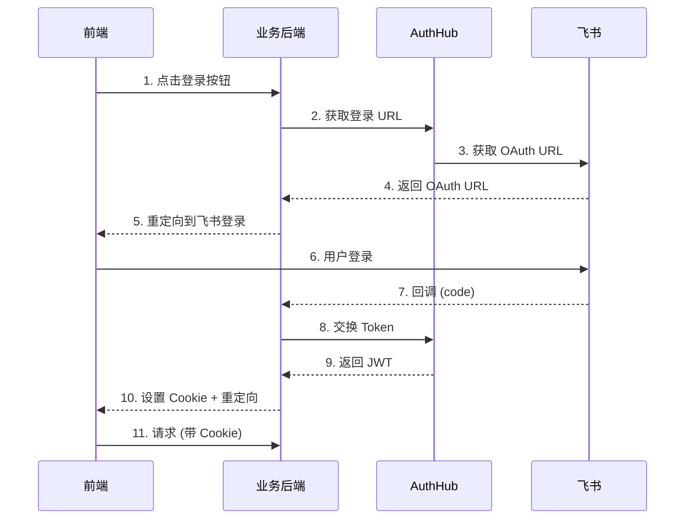

# AuthHub TypeScript SDK (轻量版)

> 适用于前后端分离架构的认证解决方案

## 核心理念

在前后端分离架构中：

- **后端（Python SDK）**：处理所有 OAuth 逻辑、Token 管理、权限验证
- **前端（TypeScript SDK）**：提供简单的工具函数和 Hook/Composable

这样既保证了安全性，又简化了前端开发。

## 特性

- ✅ **安全**：Token 存储在 HttpOnly Cookie，无法被 JavaScript 访问
- ✅ **简单**：前端只需要一个 Hook，无需处理复杂的 OAuth 流程
- ✅ **标准**：遵循前后端分离的最佳实践
- ✅ **灵活**：支持 React 和 Vue

## 安装

```bash
npm install @authhub/sdk
# 或
yarn add @authhub/sdk
# 或
pnpm add @authhub/sdk
```

## 快速开始

### 1. 后端集成（Python SDK）

在你的 FastAPI 应用中使用 Python SDK：

```python
from fastapi import FastAPI
from authhub_sdk import AuthHubClient
from authhub_sdk.middleware.fastapi_sso import setup_sso

app = FastAPI()

# 创建 AuthHub 客户端
authhub_client = AuthHubClient(
    authhub_url="http://localhost:8000",
    system_id="your-system-id",
    system_token="your-system-token",
)

# 一行代码完成 SSO 集成！
setup_sso(
    app,
    client=authhub_client,
    public_routes=["/health", "/docs"],  # 公开路由
    login_required=True,                  # 要求登录
    redirect_to_login=True,               # 未登录时重定向
)

# 获取当前用户
@app.get("/api/me")
async def get_me(request: Request):
    user = getattr(request.state, "user", None)
    if not user:
        raise HTTPException(status_code=401, detail="未登录")
    return user
```

### 2. 前端集成

#### React

```tsx
import { useAuth } from '@authhub/sdk';

function App() {
  const { user, loading, isAuthenticated, login, logout } = useAuth({
    backendUrl: 'http://localhost:8001'  // 你的业务后端地址
  });

  if (loading) return <div>Loading...</div>;
  
  if (!isAuthenticated) {
    return <button onClick={() => login()}>登录</button>;
  }

  return (
    <div>
      <p>欢迎, {user?.username}</p>
      <button onClick={logout}>登出</button>
    </div>
  );
}
```

#### Vue

```vue
<script setup>
import { useAuthVue } from '@authhub/sdk';

const { user, loading, isAuthenticated, login, logout } = useAuthVue({
  backendUrl: 'http://localhost:8001'
});
</script>

<template>
  <div v-if="loading">Loading...</div>
  <button v-else-if="!isAuthenticated" @click="login">登录</button>
  <div v-else>
    <p>欢迎, {{ user?.username }}</p>
    <button @click="logout">登出</button>
  </div>
</template>
```

## API 文档

### `useAuth` (React)

```typescript
interface UseAuthOptions {
  backendUrl: string;      // 业务后端地址
  loginPath?: string;      // 登录路由，默认 '/auth/login'
  logoutPath?: string;     // 登出路由，默认 '/auth/logout'
  mePath?: string;         // 获取用户信息路由，默认 '/api/me'
  onLogout?: () => void;   // 登出回调
}

interface UseAuthResult {
  user: User | null;              // 当前用户
  loading: boolean;               // 加载状态
  isAuthenticated: boolean;       // 是否已登录
  login: (returnUrl?: string) => void;   // 登录
  logout: () => Promise<void>;    // 登出
  refresh: () => Promise<void>;   // 刷新用户信息
}
```

### `useAuthVue` (Vue)

API 与 React 版本相同，但返回值是 `computed` 包装的响应式引用。

### `AuthClient`

如果你需要更底层的控制，可以直接使用 `AuthClient`：

```typescript
import { AuthClient } from '@authhub/sdk';

const client = new AuthClient({
  backendUrl: 'http://localhost:8001'
});

// 登录
client.login('/dashboard');

// 登出
await client.logout();

// 获取用户信息
const user = await client.getCurrentUser();

// 检查是否已登录
const isAuth = await client.isAuthenticated();
```

## 工作原理



## 完整示例

查看 `examples/` 目录：

- `examples/react-sso/` - React 示例
- `examples/vue-sso/` - Vue 示例

运行示例：

```bash
# 1. 启动 AuthHub 服务
cd ../../backend
uvicorn app.main:app --port 8000

# 2. 启动业务后端示例
cd ../sdk/python/examples
python fastapi_sso_example.py

# 3. 启动前端示例
cd ../../typescript/examples/react-sso
npm install
npm run dev
```

## 与完整 SDK 的区别

| 特性 | 轻量版 (前后端分离) | 完整版 (纯前端) |
|------|-------------------|----------------|
| Token 存储 | HttpOnly Cookie (后端) | localStorage (前端) |
| OAuth 处理 | 后端 | 前端 |
| 安全性 | ⭐⭐⭐⭐⭐ | ⭐⭐⭐ |
| 复杂度 | 低 | 中 |
| 适用场景 | 前后端分离项目 | 纯前端应用 |

## 最佳实践

1. **CORS 配置**：确保业务后端正确配置 CORS，允许前端域名访问
2. **Cookie 配置**：生产环境使用 `secure=True, httponly=True, samesite='lax'`
3. **错误处理**：后端返回 401 时，前端应重定向到登录页
4. **Token 刷新**：由后端处理 Token 刷新逻辑

## License

MIT
